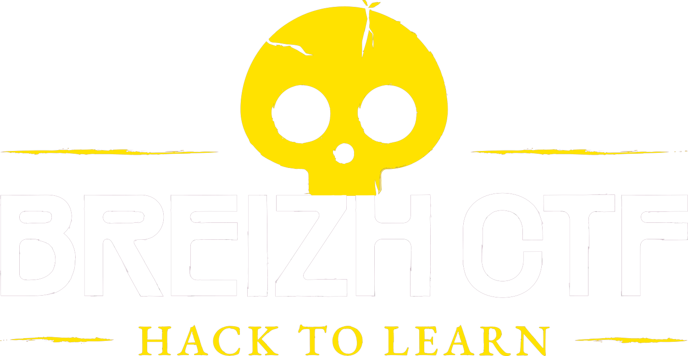
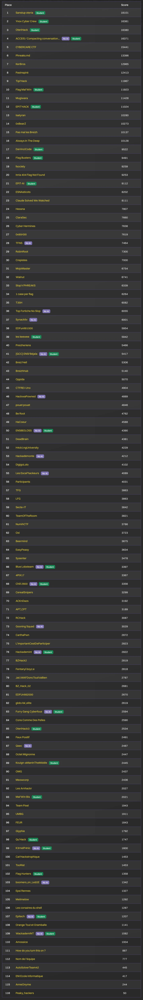

      
    <h1>Breizh CTF 2026</h1>

<h2 align="center":>Pool (par ordre alphabétique)</h2>

### Main

- [Bretagne Next](https://www.bdi.fr/fr/accueil/) (Organisateur)
- [Kaluche](https://x.com/kaluche_) (Co-fondateur, lead pool technique)
- [SaxX](https://x.com/_SaxX_) (Co-fondateur)

### Chall makers

- [AntwortEinesLebens](https://github.com/AntwortEinesLebens)
- [crazycat256](https://www.crazycat256.fr/)
- [deadc0de]()
- [IHuggsy]()
- [Korabal]()
- [Lamarr]()
- [MigatteNoChauvui](https://www.linkedin.com/in/lucas-leviaux-317088254/)
- [Nosiume](https://github.com/Nosiume)
- [Philippe_Katerine](https://github.com/polo-le-rigolo/)
- [pwnii]()
- [Shynif](antoine.rocks)
- [Vozec](https://x.com/Vozec1)
- [Zlippy](https://www.linkedin.com/in/timothee-f/)

### Infra makers

- [Ionniz](https://x.com/_Ionniz_)
- [Maëlle](https://x.com/maelle_le_bon)
- ShAdE
- Slinky
- Sp4rky
- Zeecka

<h2 align="center">Scoreboard final</h2>

