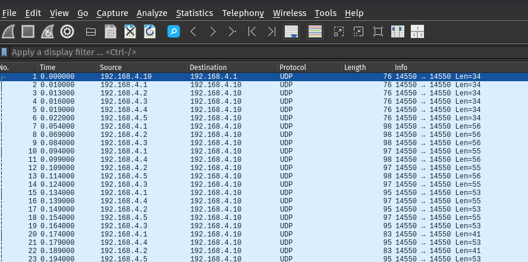

# Ghost Operator Writeup

Catégorie : Forensic / Drone

Difficulté : Medium

Flag : `BZHCTF{ALPHA_GH0ST_0P3R4T0R}`

Auteur: Lamarr
---

## 1. Identification du protocole

On ouvre `ghost_operator.pcap` dans Wireshark. Beaucoup de trafic UDP entre des machines en `192.168.4.x`, tout passe par le port 14550. Wireshark ne reconnaît pas le protocole, on voit juste du raw UDP.



En regardant les premiers octets des payloads, ça commence systématiquement par `0xFD`. Un petit tour sur Google avec "UDP 14550 drone" et on tombe vite sur MAVLink, le protocole de télémétrie standard pour les drones (ArduPilot, PX4...). L'octet `0xFD` c'est le magic byte de MAVLink v2 (v1 utilise `0xFE`).

Ref : https://mavlink.io/en/guide/serialization.html

## 2. Dissecteur Wireshark

Pour y voir clair il nous faut le dissecteur MAVLink. On utilise le plugin Lua de dagar :

https://gist.github.com/dagar/c006ce6014fd56fbdab92af062bd8e19

On copie le fichier `.lua` dans le dossier plugins de Wireshark (`~/.local/lib/wireshark/plugins/`), on relance Wireshark, et maintenant on peut filtrer avec `mavlink_proto`. Tous les messages sont décodés.


## 3. Les acteurs réseau

Maintenant qu'on décode le MAVLink, on peut mapper les IPs aux rôles. Les drones ont les IPs .1 à .5 (sysid 1 à 5), la station de contrôle sol (GCS) est en .10 (sysid 255). Les STATUSTEXT nous donnent les noms de mission : sysid 1 = ALPHA, sysid 2 = BRAVO, etc.

Mais il y a une IP qui ne colle pas : `192.168.4.42`. Elle envoie des paquets MAVLink au drone ALPHA, et elle utilise le port source 54321 au lieu de 14550 comme tout le monde.


## 4. Le signing trahit l'attaquant

En comparant un paquet de la GCS légitime (.10) avec un paquet de l'intrus (.42), on voit une différence au niveau du header MAVLink v2 : le champ `incompat_flags`.

Les paquets légitimes ont `incompat_flags = 0x01`, ce qui signifie que le message signing est activé 13 bytes de signature sont ajoutés après le CRC. Les paquets de .42 ont `incompat_flags = 0x00` : pas de signature. L'attaquant n'a pas la clé de signing de la flotte.

Packet signé:


Packet non-signé:


Ref : https://mavlink.io/en/guide/message_signing.html

## 5. Déroulé de l'attaque

En filtrant sur `ip.src == 192.168.4.42`, on voit toute la séquence. L'attaque se fait en deux phases.

Ref : https://mavlink.io/en/messages/common.html


### Phase A Usurpation de la GCS (sysid 255)

D'abord l'attaquant usurpe l'identité de la GCS pour se faire passer pour la station sol.

Il commence par envoyer un HEARTBEAT au drone ALPHA. On voit `System id: 0xff` (255, le même que la GCS légitime) mais `Packet incompat_flags: 0` — pas de signing :


Puis il demande la liste complète des paramètres du drone avec un `PARAM_REQUEST_LIST` c'est sa phase de recon :


Ensuite il enchaîne les `PARAM_SET` pour préparer le terrain. Il désactive le geofence :


Il désactive le failsafe :


Et surtout, il change `SYSID_MYGCS` à 44 son vrai sysid. A partir de là, le drone accepte les commandes venant du sysid 44 au lieu de 255 :


### Phase B Prise de contrôle (sysid 44)

L'attaquant envoie maintenant ses paquets avec sysid=44. Il passe le drone en mode GUIDED :


Il lui envoie de nouvelles coordonnées vers l'Île de Sein :


Il efface la mission légitime et en uploade une nouvelle :


Les STATUSTEXT du drone ALPHA confirment que l'attaque a fonctionné : "Mode changed to GUIDED", "Fence breach", "Position divergence detected".

Enfin, à t=65s, on voit un `DATA_TRANSMISSION_HANDSHAKE` suivi de 4 paquets `ENCAPSULATED_DATA`. C'est l'exfiltration :


## 6. Extraction des données

Le DATA_TRANSMISSION_HANDSHAKE et ENCAPSULATED_DATA font partie du protocole Image Transmission de MAVLink. C'est normalement utilisé pour transférer des images, mais rien n'empêche d'y faire passer autre chose.

Ref : https://mavlink.io/en/services/image_transmission.html

En regardant le handshake on récupère les métadonnées :
- `size = 263` : taille totale en bytes
- `packets = 4` : nombre de fragments
- `payload = 80` : taille utile par chunk


Chaque ENCAPSULATED_DATA contient un `seqnr` et un tableau `data` de 253 bytes. Mais d'après le handshake, seuls les 80 premiers bytes de chaque chunk sont utiles. Le reste c'est du padding (on voit des `0xFE` qui se répètent). Pour le dernier paquet (seqnr=3), il ne reste que 263 - 3×80 = 23 bytes de données réelles.


Ref : https://mavlink.io/en/messages/common.html#ENCAPSULATED_DATA

On écrit un petit script pour réassembler tout ça :

```python
import struct, gzip
from scapy.all import *

pkts = rdpcap("ghost_operator.pcap")

chunks = {}
for p in pkts:
    if not p.haslayer(Raw): continue
    d = bytes(p[Raw])
    if d[0] != 0xFD: continue
    mid = d[7] | (d[8]<<8) | (d[9]<<16)
    pay = d[10:10+d[1]]
    if mid == 130:
        sz = struct.unpack_from("<I", pay, 0)[0]
        nb = struct.unpack_from("<H", pay, 8)[0]
        csz = pay[11]
    if mid == 131:
        chunks[struct.unpack_from("<H", pay, 0)[0]] = pay[2:]

raw = b""
for i in range(nb):
    raw += chunks[i][:min(csz, sz - len(raw))]

print(gzip.decompress(raw).decode())
```

Les premiers bytes du blob réassemblé sont `1f 8b` c'est du gzip. On décompresse et on obtient :

```
=== GHOST OPERATOR — MISSION LOG ===
Date: 2024-04-03T12:00:00Z
Operator: GH0ST_0P3R4T0R
Target: Drone ALPHA (sysid 1)
Method: MAVLink GCS Identity Spoof + Param Hijack
Redirect: 48.0375, -4.8503 (Ile de Sein)
Status: Target acquired and redirected
Flag: BZHCTF{ALPHA_GH0ST_0P3R4T0R}
=== END LOG ===
```

Flag : `BZHCTF{ALPHA_GH0ST_0P3R4T0R}`
