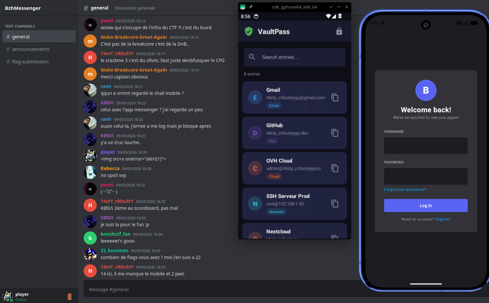

# I swear it's a feature!

- **Auteur** : [pwnii](https://x.com/pwnwithlove)
- **Catégorie** : Mobile
- **Difficulté** : Difficile

## Description

BzhMessenger, la nouvelle app de messagerie ultra-securisee du BreizhCTF.



### Chaine d'attaque

```
1. Joueur envoie un message XSS via le web chat
2. Le bot (AVD) visite le channel → WebView rend le HTML → XSS s'execute
3. JS appelle NativeBridge.setup() puis NativeBridge.processImage('|cmd')
4. Le code natif C passe le path a popen() → RCE sous l'UID de BzhMessenger
5. Decouverte de VaultPass via APK backup sur /sdcard/Download/
6. Ecriture DEX malicieux + am broadcast path traversal → DexClassLoader
7. Deserialization RCE dans VaultPass → lecture du flag → exfil nc
```

## Structure

```
ISwearItsAFeature/
├── README.md
├── challenge.yml            — Metadata CTFd
├── .gitignore
├── dist/
│   └── README.md            — Instructions pour build les APK
├── solve/
│   └── README.md            — Write-up officiel
├── src/
│   ├── server/              — Serveur Flask
│   │   ├── app.py           — API REST + web chat + vue WebView
│   │   ├── seed.py          — Users, channels, ambient chat
│   │   └── templates/
│   ├── avd/                 — Infrastructure AVD Docker
│   │   ├── Dockerfile       — Android SDK + snapshot + bot
│   │   ├── Corefile          — Config CoreDNS (resolution forum.ctf.bzh)
│   │   ├── bot.sh           — Automatise la navigation dans l'app
│   │   ├── entrypoint.sh    — Lance l'emulateur + ecrit le flag + lance le bot
│   │   └── snapshot_emulator.sh — Cree le snapshot AVD au build
│   ├── docker-compose.yml
│   ├── build.sh             — Script de build Docker
│   └── .dockerignore
```

## Run

### Prerequis

- `/dev/kvm` disponible sur l'hote
- Docker

### Build des APK

Vous pouvez aussi build les APK vous-meme depuis les sources Android.

Prerequis : Android SDK installe avec `ANDROID_HOME` configure.

```bash
# Build BzhMessenger
cd src/android-messenger
chmod +x gradlew
ANDROID_HOME=/path/to/Android/Sdk ./gradlew assembleDebug

# Build VaultPass
cd src/android-vaultpass
chmod +x gradlew
ANDROID_HOME=/path/to/Android/Sdk ./gradlew assembleDebug
```

Les libs natives ImageMagick (`.so`) sont incluses dans `android-messenger/app/src/main/jniLibs/`. Elles proviennent de [Android-ImageMagick7](https://github.com/MolotovCherry/Android-ImageMagick7/) (v7.1.2-21).

### Build de l'image Docker

L'image Docker contient tout : SDK Android, emulateur, snapshot AVD (avec les deux APKs installees), serveur Flask, bot. Elle fait ~14 Go.

```bash
cd src && bash build.sh
```

Le script `build.sh` recupere les APK depuis les dossiers de build gradle, les copie dans `avd/`, puis lance le Docker build.

> Le build necessite `docker buildx` + `--security=insecure` (KVM pendant le build pour creer le snapshot AVD). L'infra n'a **pas** besoin de builder — l'image est fournie pre-buildee via le registry ou en export.

### Deploiement (infra)

L'infra recoit l'image Docker pre-buildee (via registry ou `docker load`). Rien a builder.

```bash
# Si image fournie en fichier :
docker load < iswearitsafeature.tar.gz

# Lancer :
cd src
docker compose up -d

# Web chat joueur : http://localhost:8080
# Credentials joueur : player / bzhctf2026
```

### Variables controlees par l'infra

| Variable | Ou | Role |
|---|---|---|
| `FLAG` | docker-compose.yml `environment` | Le flag, ecrit dans `secret.key` au boot de l'emulateur |
| `TARGET_DOMAIN` | docker-compose.yml `environment` du service `dns` | Domaine du serveur Flask (prod) |
| Corefile | monte en volume sur le service `dns` | Config CoreDNS (rewrite en prod, hosts en dev) |

## DNS — CoreDNS sidecar

L'APK Android a `http://forum.ctf.bzh` en dur comme URL du serveur (`ApiConfig.kt`). Ce domaine n'existe pas — un sidecar CoreDNS est necessaire pour que l'emulateur le resolve vers le bon serveur Flask.

### Pourquoi `10.0.2.2` ?

L'emulateur Android tourne dans un reseau virtuel isole. Depuis le guest Android, `10.0.2.2` est une adresse speciale qui pointe vers le localhost de la machine hote (ici, le container Docker). C'est comme ca que l'app dans l'emulateur peut joindre le Flask qui tourne dans le meme container.

### Comment ca marche

1. L'emulateur est lance avec `-dns-server 127.0.0.1` (dans `avd/entrypoint.sh`) — toutes les requetes DNS du guest sont envoyees a CoreDNS
2. Le container `dns` (CoreDNS) partage le network namespace du container `challenge` via `network_mode: service:challenge`, donc il ecoute sur `127.0.0.1:53` du point de vue du container
3. CoreDNS resolve `forum.ctf.bzh` selon sa config (Corefile)
4. L'app Android peut alors joindre le serveur Flask sur `http://forum.ctf.bzh:80`

### Corefile (dev local)

En dev, le Corefile mappe directement `forum.ctf.bzh` vers `10.0.2.2` (= le container localhost vu depuis l'emulateur) :

```
.:53 {
    hosts {
        10.0.2.2 forum.ctf.bzh
        fallthrough
    }
    forward . /etc/resolv.conf
    log
    errors
}
```

### Verifier que le DNS fonctionne

```bash
# Logs CoreDNS — doit montrer des requetes "A IN forum.ctf.bzh" avec NOERROR
docker logs src-dns-1 2>&1 | grep forum.ctf.bzh

# Ping depuis l'emulateur — doit resoudre vers 10.0.2.2 (dev) ou l'IP du serveur (prod)
docker exec src-challenge-1 adb shell "ping -c 1 forum.ctf.bzh"
```
