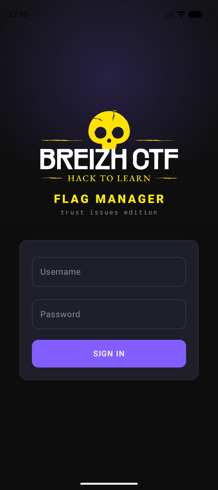
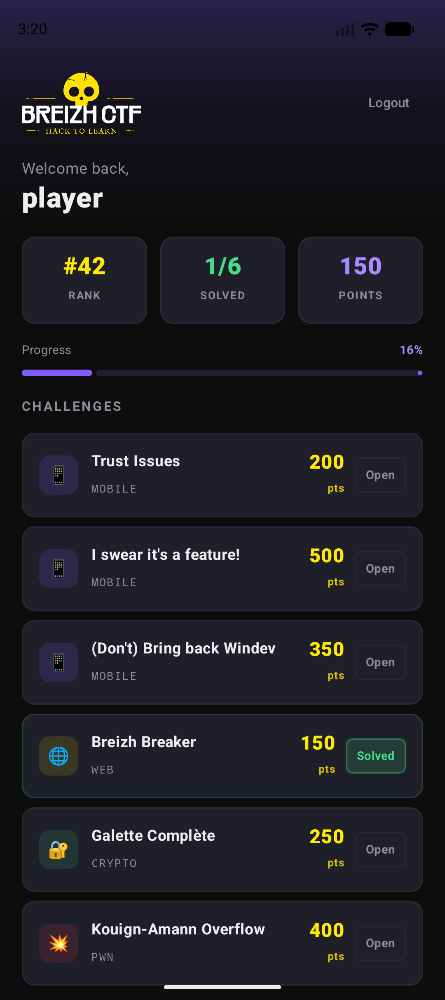

# Trust Issues

- **Auteur** : [pwnii](https://x.com/pwnwithlove)
- **Catégorie** : Mobile
- **Difficulté** : Facile

## Description

Le BreizhCTF vient de sortir sa toute nouvelle app de gestion de flags !
Connecte-toi avec les credentials fournis et trouve un moyen d'acceder au panneau d'administration pour recuperer le flag.

**Credentials:** `player / ctf2026`

## Screenshots

| Login | Dashboard |
|:-----:|:---------:|
|  |  |

## Architecture

- **App Android** : Kotlin / Jetpack Compose, client OkHttp
- **Serveur** : Flask (Python), JWT auth, rate-limited PIN verification
- **Sources Android** : `src/android-trustissue/`

## Infra

### Serveur

Le serveur Flask tourne sur le port 80 derriere le reverse proxy du CTF qui expose `https://i-have-trust-issues.ctf.bzh`.

```bash
cd src/app/
docker build -t trust-issues .
docker run --rm -p 80:80 trust-issues
```

### Build de l'APK

```bash
cd src/android-trustissue/
ANDROID_HOME=/path/to/Android/Sdk ./gradlew assembleDebug
# APK generee dans app/build/outputs/apk/debug/app-debug.apk
```

L'app Android a le domaine `https://i-have-trust-issues.ctf.bzh` hardcode dans `ApiConfig.kt`. Le joueur doit le retrouver en decompilant l'APK (jadx/apktool).
