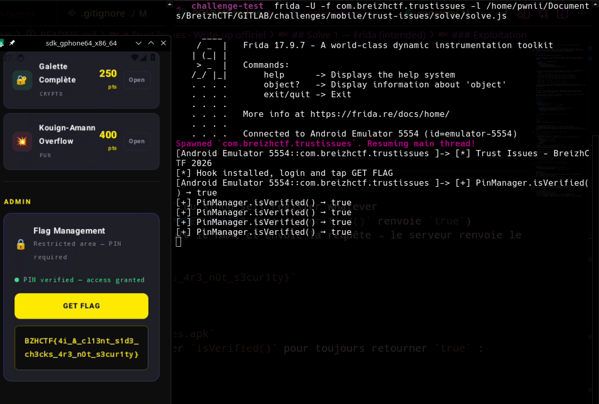

# Trust Issues - Write-up officiel

> **Catégorie:** Mobile | **Difficulté:** Easy | **Points:** 500 | **Auteur:** pwnii

## Description

L'application **BreizhCTF Flag Manager** est un client Android permettant de consulter les challenges du CTF. Un panneau "Admin" protégé par un PIN permet d'accéder au flag. Le PIN est vérifié côté serveur avec un rate-limiting (3 tentatives, lockout 60s).

## Reconnaissance

### Récupération du domaine de l'API

Aucun domaine n'est fourni dans l'énoncé : il faut le retrouver dans l'APK. En décompilant avec `jadx` (ou `apktool`), on récupère la classe `ApiConfig` :

```bash
jadx -d out trust-issues.apk
grep -r "BASE_URL\|ctf\.bzh" out/sources/com/breizhctf/trustissues/api/
```

```kotlin
// com/breizhctf/trustissues/api/ApiConfig.kt
object ApiConfig {
    const val BASE_URL = "https://i-have-trust-issues.ctf.bzh"
    const val TIMEOUT_MS = 10000L
}
```

→ L'API tourne sur `https://i-have-trust-issues.ctf.bzh`.

### Analyse du code

En continuant la décompilation, on observe :

1. **Client-side gate** — `ApiClient.getFlag()` vérifie `PinManager.isVerified()` avant d'envoyer la requête vers `/admin/flag`. Si ce booléen est `false`, la requête n'est jamais envoyée.

2. **PinManager** — Un singleton trivial :
   ```kotlin
   object PinManager {
       private var verified = false
       fun isVerified(): Boolean = verified
       fun setVerified(value: Boolean) { verified = value }
   }
   ```

3. **Signature HMAC** — `getFlag()` calcule un header `X-Verify-Token` via HMAC-SHA256. La clé est un byte array de 32 octets, splitté en 4 morceaux dans `ApiClient` :
   ```java
   // Vu dans jadx (valeurs signées Java) :
   private static final byte[] _k0 = {-115, -34, 107, -68, 44, 91, 35, 42};
   private static final byte[] _k1 = {-26, -49, -76, -15, 18, 120, -85, 100};
   private static final byte[] _k2 = {-29, 33, -3, 54, 111, -1, 55, -85};
   private static final byte[] _k3 = {-56, 119, -78, -44, -116, 110, -34, 29};
   ```
   Assemblés par `getVerifyKey()` → `_k0 + _k1 + _k2 + _k3`
   
   Format du HMAC : `HMAC-SHA256(key, token + ":" + endpoint)`

4. **Aucun secret critique dans l'APK** — Le PIN admin, le flag, et la clé JWT sont exclusivement côté serveur. Seule la clé HMAC de vérification est dans l'app (sous forme de byte arrays obfusqués).

## Vulnérabilité

Le serveur vérifie le header `X-Verify-Token` (HMAC) mais **ne vérifie pas que le PIN a réellement été saisi**. Il fait confiance au fait que l'app n'envoie ce header que quand `PinManager.isVerified()` est `true`.

En forçant `PinManager.isVerified()` à retourner `true` via Frida, l'app calcule et envoie le HMAC automatiquement — le serveur retourne le flag.

## Solve 1 — Frida (intended)

### Setup AVD (émulateur rootable + frida-server)

L'APK cible `minSdk=24` / `targetSdk=36`. On utilise une image **`google_apis`** (PAS `google_apis_playstore` — seules les images sans Play Store autorisent `adb root`, indispensable pour injecter `frida-server`).

Le script [`run_avd.sh`](./run_avd.sh) automatise toute la chaîne (install SDK image → création AVD → boot → `adb root` → push `frida-server` → install APK) :

```bash
./solve/run_avd.sh
```

Étapes effectuées :

1. `sdkmanager --install emulator platform-tools platforms;android-34 system-images;android-34;google_apis;x86_64`
2. `avdmanager create avd -n trust_issues -k <image> --device pixel_5`
3. `emulator -avd trust_issues -writable-system -no-snapshot -no-boot-anim -gpu swiftshader_indirect` (writable-system = rootfs RW pour `frida-server`)
4. Attente `sys.boot_completed=1`, puis `adb root` + `setenforce 0`
5. Téléchargement de `frida-server` matchant la version locale du client (`frida --version`), push dans `/data/local/tmp/`, lancement en arrière-plan
6. `adb install -r dist/trust-issues.apk`

Variables d'env. surchargeables : `ANDROID_SDK`, `AVD_NAME`, `API_LEVEL`, `ARCH`, `DEVICE_PROFILE`.

### Script Frida

```javascript
// solve.js — Trust Issues bypass
Java.perform(function() {
    console.log("[*] Trust Issues - BreizhCTF 2026");

    // Bypass PinManager.isVerified() → toujours true
    var PinManager = Java.use("com.breizhctf.trustissues.api.PinManager");
    PinManager.isVerified.implementation = function() {
        console.log("[+] PinManager.isVerified() → true");
        return true;
    };

    console.log("[*] Hook installed, login and tap GET FLAG");
});
```

### Exploitation

```bash
# Lancer l'app avec Frida
frida -U -f com.breizhctf.trustissues -l solve.js
```

1. L'app se lance avec le hook actif
2. Se connecter avec `player` / `ctf2026` ou sinon self register whatever
3. Le panneau Admin affiche directement **GET FLAG** (car `isVerified()` renvoie `true`)
4. Cliquer sur **GET FLAG** → l'app calcule le HMAC et envoie la requête → le serveur renvoie le flag


**Flag:** `BZHCTF{4i_&_cl13nt_s1d3_ch3cks_4r3_n0t_s3cur1ty}`

## Solve 2 — Patch APK (smali)

1. Décompiler avec `apktool d trust-issues.apk`
2. Dans le smali de `PinManager`, modifier `isVerified()` pour toujours retourner `true` :
   ```smali
   .method public final isVerified()Z
       .registers 2
       const/4 v0, 0x1    # forcer true
       return v0
   .end method
   ```
3. Rebuild : `apktool b trust-issues -o patched.apk`
4. Signer : `uber-apk-signer -a patched.apk`
5. Installer et utiliser normalement — l'app calcule le HMAC toute seule

## Solve 3 — curl (nécessite reverse engineering)

Le curl direct ne fonctionne **pas** — le serveur vérifie un `X-Verify-Token` (HMAC-SHA256). Il faut décompiler l'APK avec `jadx` pour trouver la clé et l'algorithme.

```bash
# 1. Décompiler pour trouver la clé HMAC et le domaine
jadx -d out trust-issues.apk
grep -r "HmacSHA256\|_k0\|getVerifyKey\|X-Verify-Token\|BASE_URL" out/
# → BASE_URL = https://i-have-trust-issues.ctf.bzh
# → 4 byte arrays _k0.._k3 à reconstituer
# → format: HMAC-SHA256(key, token + ":" + endpoint)

# 2. Reconstituer la clé (conversion signed Java → hex)
# _k0 = {-115, -34, 107, -68, 44, 91, 35, 42}  → 8dde6bbc2c5b232a
# _k1 = {...}

# 3. Login
TOKEN=$(curl -s -X POST https://i-have-trust-issues.ctf.bzh/login \
  -H "Content-Type: application/json" \
  -d '{"username":"player","password":"ctf2026"}' | jq -r .token)

# 4. Calculer le HMAC
HMAC=$(python3 -c "
import hmac, hashlib
key = bytes.fromhex('8dde6bbc2c5b232ae6cfb4f11278ab64e321fd366fff37abc877b2d48c6ede1d')
data = '${TOKEN}:/admin/flag'.encode()
print(hmac.new(key, data, hashlib.sha256).hexdigest())
")

# 5. Récupérer le flag
curl -s -H "Authorization: Bearer $TOKEN" \
  -H "X-Verify-Token: $HMAC" \
  https://i-have-trust-issues.ctf.bzh/admin/flag | jq .
```

> **Note :** Cette méthode nécessite de retrouver 4 byte arrays signés dans le code décompilé, les convertir en hex, comprendre le format du HMAC, et reimplémenter la signature. Beaucoup plus de travail que le hook Frida (enfin si c'est fait par un humain, par une IA)

## Résumé des méthodes

| Méthode | Étapes clés | Difficulté |
|---------|-------------|------------|
| **Frida** (intended) | Hook `isVerified()` → `true`, l'app fait le reste |
| **Patch APK** | apktool + modifier smali `isVerified` + rebuild |
| **curl** | Décompiler + reconstituer clé HMAC (4 byte arrays) + implémenter signature |
