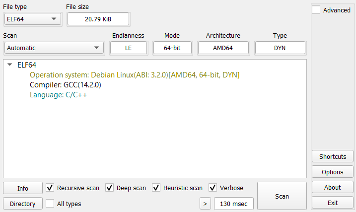
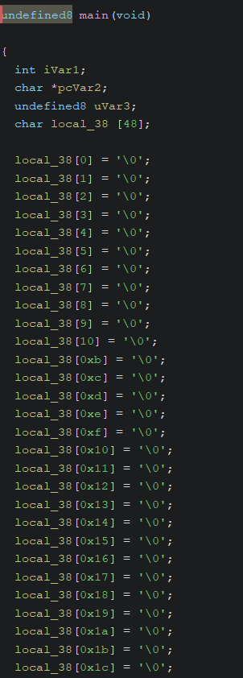
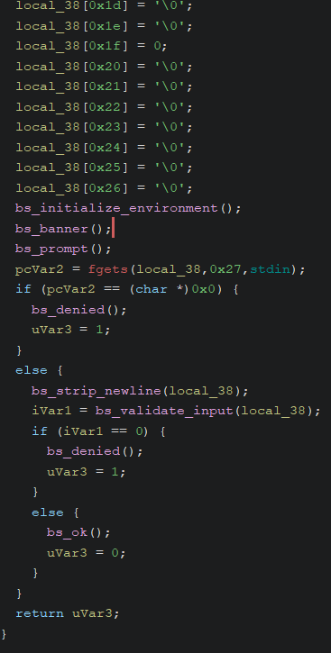
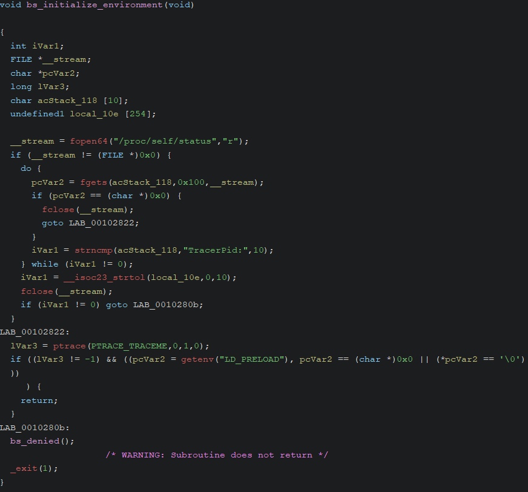
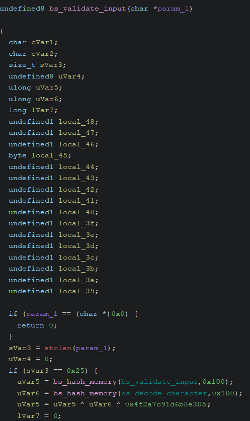
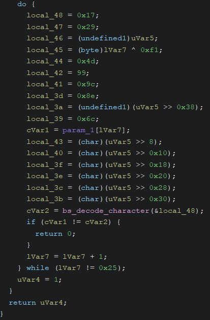
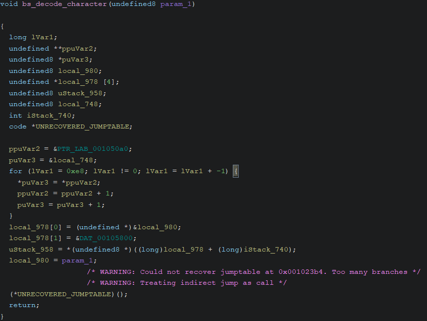
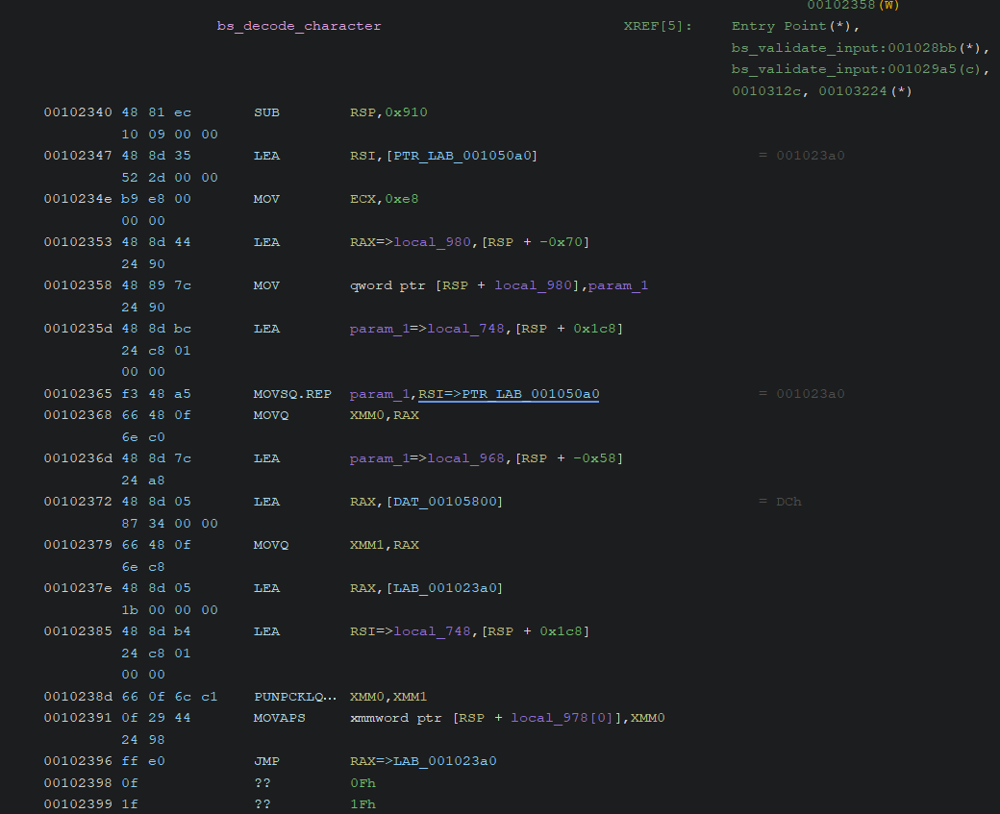
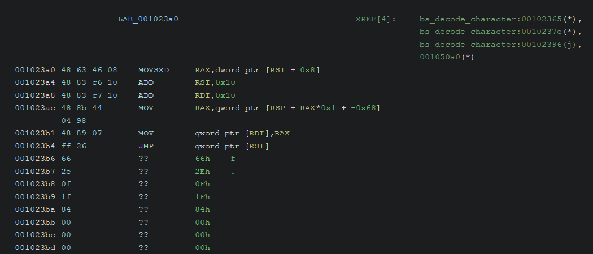
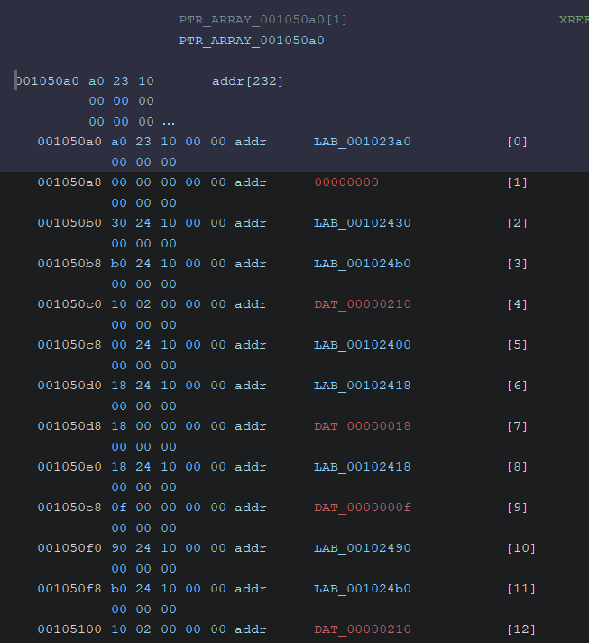

# Emulated Trust - Writeup

## Informations

- **Catégorie** : Reverse
- **Difficulté** : Moyen
- **Auteur** : AntwortEinesLebens

## Énoncé

Breizh Systems a développé un prototype intégrant plusieurs mécanismes destinés
à protéger l'exécution de ses binaires critiques.

Ce programme applique différentes politiques internes visant à détecter toute
tentative d'analyse ou de modification.

Comprendre comment contourner ces protections pourrait être déterminant.

**Fichiers fournis :**

- `bs_emulated_trust`

## Résumé

Le challenge est un binaire protégé par plusieurs mécanismes d'anti-debug et
d'anti-tamper, avec une logique en fail fast. Une approche statique ou
dynamique reste possible, mais l'émulation est la méthode la plus simple,
notamment en récupérant directement le résultat de la fonction qui décode
chaque caractère du flag.

## Analyse initiale

### DIE - Detect It Easy

Nous pouvons d'abord passer le binaire dans
[DIE](https://github.com/horsicq/Detect-It-Easy) pour vérifier s'il n'est pas
packé et obtenir d'autres informations.



Le binaire n'est pas packé. Il s'agit d'un ELF 64-bit écrit en C et compilé
avec GCC.

### Exécution du binaire

Pour avoir une idée de ce que fait le programme, nous l'exécutons d'abord :

```bash
$ ./bs_emulated_trust
Breizh Systems :: artifact emulated-trust
Breizh Systems :: enter token: test
Breizh Systems :: status: denied
```

Le programme demande un **token** et valide notre entrée.
Si on entre n'importe quoi, on obtient `status: denied`.
Nous devons donc trouver la fonction de validation.

### Strings

Nous commençons par regarder les chaînes de caractères dans le binaire :

```bash
$ strings bs_emulated_trust
Breizh Systems :: status: ok
/proc/self/status
TracerPid:
LD_PRELOAD
Breizh Systems :: artifact emulated-trust
Breizh Systems :: enter token: 
Breizh Systems :: status: denied
Breizh Systems // artifact emulated-trust // build E7
```

En effectuant la commande `strings`, nous voyons certaines chaînes mais aucun
flag apparent. Nous identifions aussi le message de réussite présumé
(goodboy) : `status: ok`, et le message d'échec (badboy) : `status: denied`.

Nous repérons également plusieurs chaînes comme `/proc/self/status`,
`TracerPid:` et `LD_PRELOAD`, qui peuvent être liées à des mécanismes
d'anti-debug. De nombreuses techniques anti-debug sont présentées sur
[Checkpoint](https://anti-debug.checkpoint.com/), même si le site est plutôt
orienté Windows.

## Analyse statique

Pour cette analyse, nous utilisons [Ghidra](https://ghidra-sre.org/), mais
vous êtes libre d'utiliser ce que vous voulez.

### Fonctions principales

Après avoir fait analyser le binaire par Ghidra, nous trouvons la fonction
`main` du binaire.

En l'analysant rapidement, nous voyons qu'il récupère l'entrée utilisateur et
qu'il affiche notre message de succès ou d'erreur après avoir fait un présumé
check.





Nous voyons aussi dans la vue décompilée que certains symboles ne sont pas
strippés et sont préfixés par `bs`.

Notre énoncé mentionne des mécanismes de détection d'analyse et de
modification, et nous avons déjà repéré plusieurs éléments suspects dans les
chaînes de caractères du binaire. Regardons donc la fonction
`bs_initialize_environment` avant d'aller plus loin.



Nous voyons que cette fonction met en place plusieurs vérifications
d'anti-debug relativement classiques.

La première consiste à lire le fichier
[`/proc/self/status`](https://man7.org/linux/man-pages/man5/proc_pid_status.5.html)
pour en extraire la valeur de `TracerPid`. Sous Linux, ce champ indique le PID du processus qui
trace le programme. Si sa valeur est différente de `0`, cela signifie que le
binaire est déjà observé par un debugger, et l'exécution est immédiatement
interrompue avec `status: denied`.

La fonction effectue ensuite un appel à
[`ptrace(PTRACE_TRACEME, ...)`](https://man7.org/linux/man-pages/man2/ptrace.2.html).
Cette technique est elle aussi très répandue, si l'appel échoue, cela peut
indiquer qu'un autre processus est déjà en train de débugger le binaire.

Enfin, le programme vérifie la présence de la variable d'environnement
[`LD_PRELOAD`](https://man7.org/linux/man-pages/man8/ld.so.8.html). Sous Linux,
cette variable permet d'injecter une bibliothèque
partagée avant le chargement normal du programme. Elle peut notamment servir à
hooker certaines fonctions, par exemple `ptrace`, afin de contourner ce type de
protection. Si `LD_PRELOAD` est défini et non vide, le binaire considère cela
comme suspect et s'arrête immédiatement.

En revenant dans la fonction principale, nous voyons qu'après cette phase
d'initialisation, le programme récupère l'entrée utilisateur, appelle
`bs_validate_input`, puis affiche un message de succès ou d'échec en fonction
du résultat.

Regardons maintenant le contenu de cette fonction :





Nous remarquons d'abord que la fonction vérifie la taille de l'entrée et la
compare à `0x25`, soit 37 caractères.

Ensuite, elle appelle `bs_hash_memory` deux fois, une première fois sur
`bs_validate_input`, puis une seconde fois sur `bs_decode_character`.
Les deux valeurs obtenues sont ensuite combinées par XOR, puis XORées une
nouvelle fois avec la constante `0x4f2a7c91d6b8e305`. Le résultat sera
réutilisé plus loin dans la fonction.

```
uVar5 = bs_hash_memory(bs_validate_input,0x100);
uVar6 = bs_hash_memory(bs_decode_character,0x100);
uVar5 = uVar5 ^ uVar6 ^ 0x4f2a7c91d6b8e305;
```

Une fois ces premières vérifications effectuées, la fonction parcourt ensuite
chaque caractère de notre entrée dans une boucle.

À chaque itération, elle construit un buffer contenant plusieurs valeurs
prédéfinies, des morceaux du hash combiné calculé précédemment et
l'index courant après une opération de XOR. Ce buffer sert de contexte et sera
passé à une autre fonction afin de rendre la logique réelle de validation un
peu moins directe à suivre.

```
local_48 = 0x17;
local_47 = 0x29;
local_46 = (undefined1)uVar5;
local_45 = (byte)lVar7 ^ 0xf1;
local_44 = 0x4d;
local_42 = 99;
local_41 = 0x9c;
local_3d = 0x8e;
local_3a = (undefined1)(uVar5 >> 0x38);
local_39 = 0x6c;
cVar1 = param_1[lVar7];
local_43 = (char)(uVar5 >> 8);
local_40 = (char)(uVar5 >> 0x10);
local_3f = (char)(uVar5 >> 0x18);
local_3e = (char)(uVar5 >> 0x20);
local_3c = (char)(uVar5 >> 0x28);
local_3b = (char)(uVar5 >> 0x30);
```

Après cela, ce contexte est passé à `bs_decode_character`, puis le résultat
renvoyé est comparé avec le caractère courant de notre entrée.

Si la comparaison échoue, la fonction s'arrête immédiatement et renvoie `0`.
La validation fonctionne en mode *fail fast*. Le flag n'est jamais
reconstruit entièrement en mémoire en clair, un dump mémoire simple ne suffit
pas à retrouver tout le flag.

Ce n'est que si tous les caractères correspondent que la boucle se termine et
que la fonction renvoie finalement `1`.

Pour comprendre la logique de validation, regardons maintenant la fonction
`bs_decode_character` :



Nous voyons plusieurs éléments intéressants. Tout d'abord, la fonction copie en
local un tableau de `qword`. Ce tableau contient `0xe8`, soit 232 entrées.
Après quelques assignations à des variables locales, nous tombons sur ceci :

```
/* WARNING: Could not recover jumptable at 0x001023b4. Too many branches */
/* WARNING: Treating indirect jump as call */
(*UNRECOVERED_JUMPTABLE)();
```

Le décompilateur nous indique qu'il y a trop de branches et qu'il ne parvient
pas à reconstruire correctement la jump table.
Pour mieux comprendre ce comportement, regardons l'assembleur :



Nous voyons qu'à la fin, le code saute vers `RAX`, qui contient l'adresse
`0x001023a0`. En regardant ce qui se trouve à cette adresse, nous obtenons :



Dans cette portion, nous voyons que le code lit des valeurs à l'adresse pointée
par `RSI`, puis incrémente ce pointeur. Nous voyons également qu'à la fin, il
saute vers l'adresse stockée à l'emplacement courant.

En remontant un peu plus haut dans la fonction, nous voyons que `RSI` contient
le buffer local dans lequel le tableau de pointeurs a été copié. On comprend
donc que `RSI` sert ici de pointeur d'instruction virtuel sur ce tableau.

En retypant dans Ghidra le buffer original de cette jump table, nous obtenons
ceci :



Cependant, certains pointeurs apparaissent comme invalides dans Ghidra,
notamment ceux affichés en rouge sur la capture. Cela indique que nous ne sommes
pas face à une jump table classique.

En pratique, cette structure correspond au code d'une petite VM. La fonction
`bs_decode_character` est virtualisée. Le tableau ne contient pas uniquement des
adresses de handlers, mais également leurs opérandes. Ce tableau sert donc de
bytecode pour notre fonction virtualisée.

Dans notre cas, une entrée commence par un pointeur vers un handler, puis les
valeurs qui suivent servent d'arguments à ce handler. Nous pouvons le voir sur
le premier exemple, le handler ajuste `RSI` de `0x10`, soit 16 octets, ce qui
correspond à deux pointeurs de 64 bits. Cela montre bien que la seconde valeur
de l'entrée n'est pas une adresse valide, mais une donnée consommée par le
handler.

Une fois ce déplacement effectué, `RSI` pointe de nouveau vers la prochaine
adresse de handler valide. La routine de décodage de chaque caractère est donc
virtualisée, ce qui rend sa lecture directe beaucoup moins confortable en
analyse statique.

Notez également que les octets parfois affichés comme des pseudo-instructions
ou comme des bytes isolés entre deux handlers correspondent simplement à du
padding d'alignement, c'est-à-dire à des séquences de NOP multi-octets.

### Angles d'attaques

Pour résoudre ce challenge, plusieurs approches sont possibles.

La première consiste à contourner les mécanismes d'anti-debug, puis à récupérer
la valeur de retour de chaque appel à `bs_decode_character` afin de reconstruire
le flag caractère par caractère.

Cependant, même en contournant ces protections, il faut faire attention à
l'anti-tamper. La fonction de validation calcule un hash de
`bs_validate_input` et de `bs_decode_character`. Si nous plaçons un breakpoint
logiciel, nous modifions le code en mémoire, ce qui change le hash et donc le
résultat du décodage. Dans ce contexte, seuls des breakpoints matériels restent
réellement adaptés, puisqu'ils n'altèrent pas la mémoire du programme. Dans le
cas des breakpoints matériels, le binaire ne cherche pas à altérer leur
fonctionnement et ne semble pas non plus tenter de les détecter.

La deuxième possibilité serait de dévirtualiser `bs_decode_character`. Cela
demande d'identifier les éléments importants de la VM, comme le pointeur
d'instruction virtuel, la pile virtuelle et le rôle de chaque handler.
Une fois cette étape terminée, il faudrait encore reconstruire une sémantique
correcte, voire écrire un désassembleur dédié. Des outils comme
[VTIL](https://github.com/vtil-project/VTIL-Core) peuvent aider, mais ce
travail reste largement manuel.

Enfin, l'approche que nous allons retenir est la plus simple et la plus rapide :
l'émulation. Elle permet d'éviter naturellement les mécanismes d'anti-debug,
sans avoir à les patcher un par un, tout en nous laissant observer directement
le résultat produit par la routine de décodage.

## Solution

Comme vu précédemment, la validation fonctionne en *fail fast* : à chaque
itération, le programme prépare un contexte, appelle `bs_decode_character`, puis
compare immédiatement le caractère décodé avec notre entrée.

Plutôt que de reconstituer toute la logique de décodage à la main,
l'approche la plus simple consiste à laisser le binaire faire ce travail pour
nous, puis à récupérer directement le résultat produit par
`bs_decode_character` pendant l'émulation.

Pour cela, nous utilisons [Qiling](https://qiling.io/), qui permet d'émuler le
binaire et d'ajouter un hook à l'endroit qui nous intéresse.

Nous fournissons d'abord une entrée factice de la bonne longueur, ici
`"A" * FLAG_LENGTH`, afin que la fonction de validation entre bien dans sa
boucle de comparaison caractère par caractère.

Ensuite, nous plaçons un hook juste après l'appel à `bs_decode_character`, au
moment où la comparaison avec notre entrée va être effectuée. À cet instant,
le caractère décodé est déjà disponible dans `RAX`. Il suffit donc de
récupérer son octet de poids faible et de l'ajouter à notre flag reconstruit.

Dans notre script, cela donne :

```python
FLAG_LENGTH = 37
COMPARE_OFFSET = 0x29AA

flag = ""


def dump_character(qiling: Qiling):
    global flag

    flag += chr(qiling.arch.regs.rax & 0xFF)
    qiling.arch.regs.rax = qiling.arch.regs.r13
```

La ligne `flag += chr(qiling.arch.regs.rax & 0xFF)` récupère directement le
caractère décodé renvoyé par la fonction.

La ligne `qiling.arch.regs.rax = qiling.arch.regs.r13` permet de falsifier la
condition afin de continuer la boucle sans patcher le binaire.

Pour rendre cette comparaison toujours vraie, nous avons deux approches
simples : soit comparer le caractère utilisateur avec lui-même, ce que nous
faisons ici, soit comparer le bon caractère avec lui-même.

Nous pouvons ensuite initialiser Qiling, injecter notre entrée factice,
poser le hook et lancer l'émulation :

```python
qiling = Qiling([args.binary], args.rootfs, verbose=QL_VERBOSE.OFF)
qiling.os.stdout = open(os.devnull, "wb")
qiling.os.stderr = open(os.devnull, "wb")

qiling.os.stdin = pipe.SimpleInStream(0)
qiling.os.stdin.write(("A" * FLAG_LENGTH + "\n").encode())

address = qiling.loader.images[0].base + COMPARE_OFFSET
qiling.hook_address(dump_character, address)
qiling.run()

print(flag)
```

À la fin de l'exécution, notre variable `flag` contient l'intégralité du flag.
Vous pouvez retrouver le script de solve complet dans `solve/solve.py`.

## Flag

Nous obtenons ce flag `BZHCTF{50m371m35_3mu14710n_15_34513r}`.
