# Lost in a Maze - Writeup

## Informations

- **Catégorie** : Reverse
- **Difficulté** : Difficile
- **Auteur** : AntwortEinesLebens

## Énoncé

Un dev nommé Mousshack aime développer des jeux vidéo et, avec l'essor de l'IA,
il a décidé de coder un jeu dans le terminal.

Pour la connexion avec le serveur, il a rejeté TLS et inventé un algorithme de
chiffrement sans échange de clé.

Convaincu que sa solution révolutionne les échanges mondiaux, il vous envoie son
jeu et une capture réseau d'une partie avec un secret caché. Montrez-lui qu'il
se trompe.

**Fichiers fournis :**

- `lost_in_a_maze`
- `template.py`
- `game.pcap`

## Résumé

Le challenge fournit un client de jeu et une capture réseau d'une partie en
ligne. Le client communique avec le serveur en UDP et chiffre les paquets avec
AES-GCM.

En analysant le binaire, on retrouve la logique du protocole. Chaque paquet est
chiffré avec une clé dérivée du `SHA256` du dernier paquet déchiffré. Le premier
paquet étant envoyé en clair, il est possible de rejouer toute la chaîne de
déchiffrement sur la capture jusqu'à récupérer le message de victoire contenant
le flag.

## Analyse initiale

### DIE - Detect It Easy

Nous commençons par analyser le binaire avec
[DIE](https://github.com/horsicq/Detect-It-Easy) afin de vérifier s'il est
packé et d'obtenir quelques informations supplémentaires.

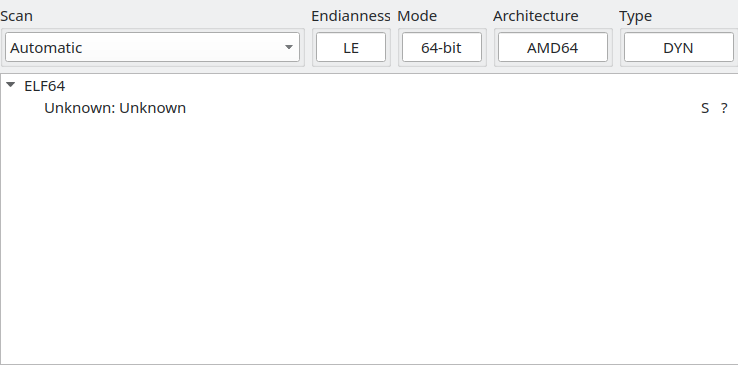

Le binaire n'est pas packé. Il s'agit d'un ELF 64 bits, mais nous n'obtenons
pas beaucoup plus d'informations utiles à ce stade.

### Exécution du binaire

Pour comprendre le comportement du programme, nous commençons par l'exécuter :

```bash
$ ./lost_in_a_maze
```

Après le lancement, nous arrivons sur une [TUI](https://en.wikipedia.org/wiki/Text-based_user_interface)
qui propose un mode en ligne et un mode hors ligne :

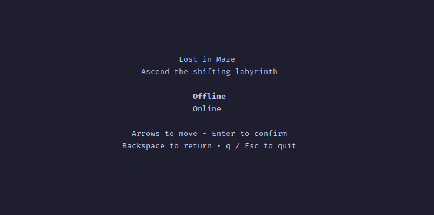

Si nous choisissons le mode en ligne, une erreur s'affiche. Le serveur n'est
donc pas disponible, comme on pouvait s'y attendre :

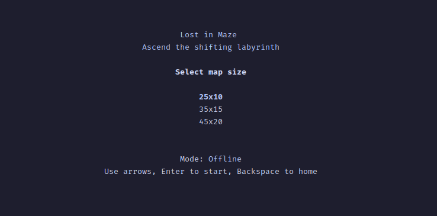

En sélectionnant le mode hors ligne, plusieurs tailles de carte sont proposées :

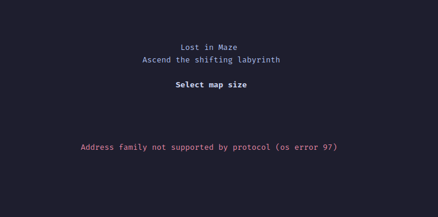

En choisissant la plus petite carte, nous arrivons dans le jeu :

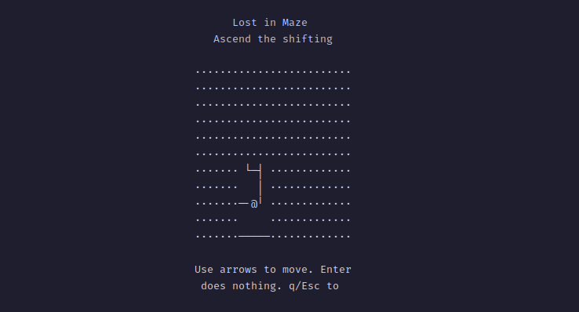

Nous pouvons nous déplacer dans un labyrinthe. Seules les cases proches du
joueur, représenté par un `@`, sont visibles.
Après quelques déplacements, nous pouvons trouver la sortie, représentée par un
`*` :

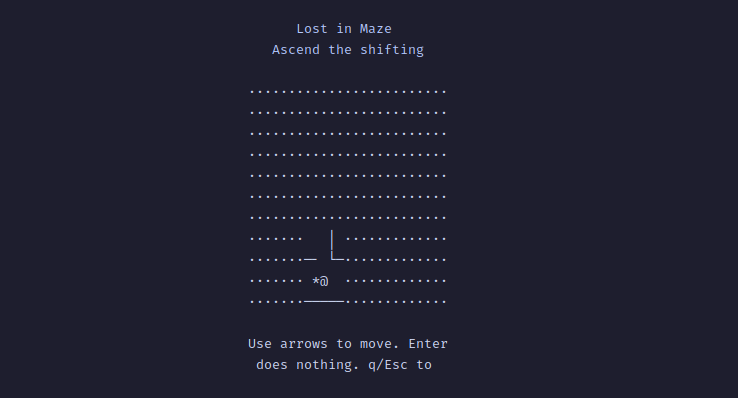

En marchant sur ce symbole, tout le labyrinthe devient visible et un message
s'affiche :

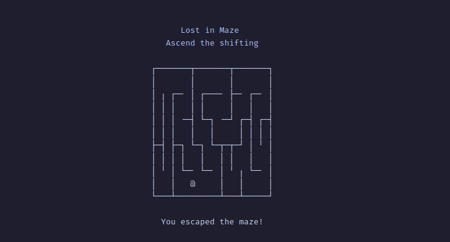

En testant d'autres tailles de carte, nous constatons que les labyrinthes sont
générés à chaque partie et que le message de fin reste toujours le même. Nous
devons donc nous concentrer sur le mode en ligne, car c'est probablement là que
se trouve le flag. Pour cela, nous disposons uniquement du binaire et d'une
capture réseau.

### Strings

Nous regardons ensuite les chaînes de caractères présentes dans le binaire :

La sortie étant assez longue, nous ne gardons ici que les chaînes les plus
intéressantes :

```bash
$ strings lost_in_a_maze
_ZN4sha26sha25611compress25617h78d73f9c89009d1fE
_ZN7aes_gcm39AesGcm$LT$Aes$C$NonceSize$C$TagSize$GT$11compute_tag17h2557997a33770e12E
crates/client/src/game/offline.rs
crates/game/src/maze.rs
crates/client/src/components/game.rs
crates/client/src/game/online.rs
crates/client/src/components/selection.rs
yE>NulErrorLost in MazeAscend the shifting labyrinth
a Display implementation returned an error unexpectedlyErrorNo game client availableOnlineOfflineSelect map sizeMode: Use arrows, Enter to start, Backspace to home
[?1000ldescription() is deprecated; use DisplayErrorinnerInvalidLengthlocalhost:4000Network error. Press Enter to return to menu.
_ZN6client4game6online16OnlineGameClient7connect17h2bc57b4fdf761308E
_ZN91_$LT$client..game..online..OnlineGameClient$u20$as$u20$client..game..client..GameClient$GT$10start_game17h76d5c58c684e6cfeE
_ZN91_$LT$client..game..online..OnlineGameClient$u20$as$u20$client..game..client..GameClient$GT$11move_player17h7e744932c83f2bcaE
_ZN3std3net3udp9UdpSocket9recv_from17h6b42ae555b966359E
_ZN3std3net3udp9UdpSocket7send_to17hdd82645d93a1ff27E
```

Cette sortie ne révèle pas directement le flag, mais elle donne plusieurs
informations utiles. Certaines chaînes apparaissent collées dans la sortie de
`strings`, mais on retrouve tout de même des éléments exploitables. La présence
de chemins en `.rs` indique que le binaire est écrit en Rust. On remarque aussi
des références à des algorithmes de chiffrement ou de hachage, comme `sha256` et
`aes_gcm`. Le namespace `client` est également intéressant, avec des fonctions
liées au mode en ligne comme
`OnlineGameClient::connect`, `start_game` ou `move_player`. Enfin, la chaîne
`localhost:4000` et les symboles liés à `UdpSocket` donnent un premier indice
sur la communication réseau utilisée par le mode en ligne. Les noms de symboles
qui commencent par `_ZN` sont dus au
[name mangling de Rust](https://doc.rust-lang.org/stable/rustc/symbol-mangling/index.html).

## Analyse statique

Pour cette analyse, nous utilisons [Ghidra](https://ghidra-sre.org/), mais
vous êtes libre d'utiliser ce que vous voulez.

### Fonctions principales

Après avoir fait analyser le binaire par Ghidra, nous trouvons la fonction
`main` du binaire.

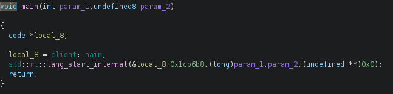

Nous voyons que la fonction principale se trouve dans le namespace `client`.

Regardons maintenant ce namespace :

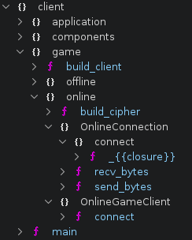

Nous voyons notamment un namespace `online`, qui contient plusieurs éléments
intéressants :

- une fonction `build_cipher`
- un type `OnlineConnection`, avec les fonctions `connect::_{{closure}}`,
  `recv_bytes` et `send_bytes`
- un type `OnlineGameClient`, avec une fonction `connect`.

Nous pouvons aussi vérifier s'il existe d'autres namespaces ou fonctions qui
utilisent nos deux types `OnlineConnection` et `OnlineGameClient` :

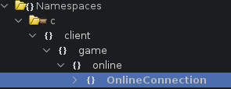

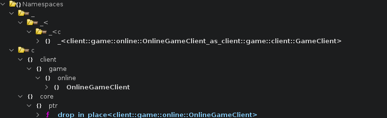

Pour `OnlineConnection`, nous ne voyons pas d'autres usages que ceux déjà
identifiés. Nous savons qu'il s'agit d'un type, mais pas encore précisément s'il
s'agit d'une `struct`, d'un `enum` ou d'autre chose.

En revanche, nous voyons plus d'informations pour `OnlineGameClient`, notamment
des symboles de la forme
`<client::game::online::OnlineGameClient as client::game::client::GameClient>`.
Cela signifie que `OnlineGameClient` est un type concret qui implémente le trait
`GameClient`.

Regardons maintenant les fonctions exposées par ce trait :

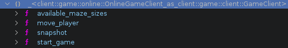

Nous voyons plusieurs fonctions intéressantes, comme `available_maze_sizes`,
`move_player`, `snapshot` et `start_game`. Le nom de ces fonctions permet déjà
de deviner une grande partie de leur rôle dans le client de jeu.

Nous disposons d'un pcap et nous devons donc comprendre les échanges réseau qui
ont été effectués. Pour l'instant, leur contenu est incompréhensible.

Pour cela, nous allons d'abord nous attarder sur les fonctions `recv_bytes` et
`send_bytes`. La fonction `build_cipher` est aussi intéressante. Si nous ne
trouvons rien, nous pourrons ensuite regarder les autres fonctions identifiées.

Commençons par `send_bytes` :

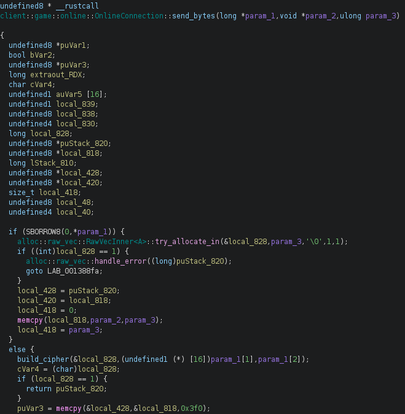

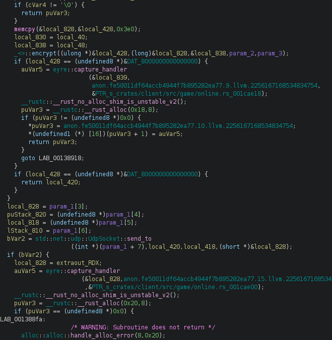

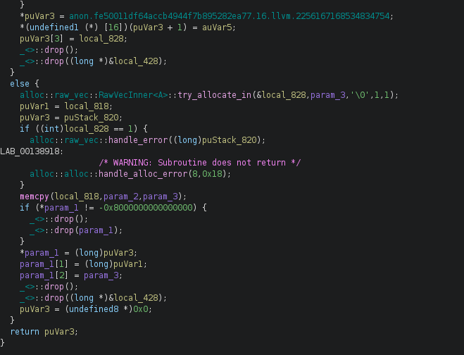

Avant de commencer l'analyse, il faut garder en tête quelques détails sur la
représentation des types Rust. Certains types, comme les slices (`&[u8]`) ou les
chaînes (`&str`), sont représentés par deux valeurs. Il y a un pointeur vers les
données et une taille. Le compilateur passe ces deux informations séparément,
ce que l'on retrouve ensuite dans le code décompilé.

Pour repérer ce cas, nous pouvons regarder si deux paramètres sont utilisés
ensemble. Par exemple, nous voyons à un moment ceci :

`memcpy(local_818,param_2,param_3);`

Nous voyons que le contenu pointé par `param_2` est copié dans `local_818`, sur
une taille de `param_3` octets. Ces deux paramètres sont donc probablement liés.
Cela ressemble à la représentation d'un slice, même s'il faudra continuer
l'analyse pour déterminer précisément son type.

Il faut aussi faire attention aux types comme `Option` ou `Result`, très présents
dans les binaires Rust. Leur représentation dépend du type contenu et le
compilateur peut utiliser des optimisations, comme le niche optimization, pour
éviter d'ajouter un tag explicite quand certaines valeurs sont impossibles. Dans
le décompilateur, cela peut donner beaucoup de conditions, de valeurs spéciales
et de chemins d'erreurs.

Le code Rust décompilé est donc souvent très verbeux. C'est normal, mais cela
peut rendre l'analyse plus difficile au début.

Dans cette fonction, nous voyons deux branches principales. La première est
prise lorsqu'aucun paquet précédent n'est encore stocké dans la structure :

```c
if (SBORROW8(0,*param_1)) {
  alloc::raw_vec::RawVecInner<A>::try_allocate_in(&local_828,param_3,'\0',1,1);
  if ((int)local_828 == 1) {
    alloc::raw_vec::handle_error((long)puStack_820);
    goto LAB_001388fa;
  }
  local_428 = puStack_820;
  local_420 = local_818;
  local_418 = 0;
  memcpy(local_818,param_2,param_3);
  local_418 = param_3;
}
```

Le code alloue alors un buffer de taille `param_3`, puis copie le contenu pointé
par `param_2` dedans. La taille utilisée pour la copie est aussi `param_3`, ce
qui confirme que `param_2` et `param_3` forment un slice. `param_2` correspond
au pointeur vers les données et `param_3` à leur taille. Dans ce cas, le paquet
sera donc envoyé tel quel.

La deuxième branche est prise lorsqu'un paquet précédent est déjà stocké :

```c
else {
  build_cipher(&local_828,(undefined1 (*) [16])param_1[1],param_1[2]);
  cVar4 = (char)local_828;
  if (local_828 == 1) {
    return puStack_820;
  }
  puVar3 = memcpy(&local_428,&local_818,0x3f0);
  if (cVar4 != '\0') {
    return puVar3;
  }
  memcpy(&local_828,&local_428,0x3e0);
  local_830 = local_40;
  local_838 = local_48;
  _<>::encrypt((ulong *)&local_428,(long)&local_828,&local_838,param_2,param_3);
  if (local_428 == (undefined8 *)&DAT_8000000000000000) {
    auVar5 = eyre::capture_handler
                        (&local_839,
                        anon.fe50011df64accb4944f7b895282ea77.9.llvm.2256167168534834754,
                        &PTR_s_crates/client/src/game/online.rs_001cae18);
    __rustc::__rust_no_alloc_shim_is_unstable_v2();
    puVar3 = __rustc::__rust_alloc(0x18,8);
    if (puVar3 != (undefined8 *)0x0) {
      *puVar3 = anon.fe50011df64accb4944f7b895282ea77.10.llvm.2256167168534834754;
      *(undefined1 (*) [16])(puVar3 + 1) = auVar5;
      return puVar3;
    }
    goto LAB_00138918;
  }
  if (local_428 == (undefined8 *)&DAT_8000000000000000) {
    return local_420;
  }
}
```

Une grande partie de ce code correspond à de la gestion d'erreurs et à des copies
intermédiaires générées par Rust. La logique importante est que `build_cipher`
est appelée avec des valeurs lues dans `param_1`, ce qui indique que `param_1` est
un pointeur vers une structure. Comme la fonction lit l'état de cette structure
et stocke ensuite de nouvelles valeurs dedans, `param_1` correspond donc au
`self` de la méthode.

L'adresse de `local_828` est passée à
`build_cipher`, puis cette zone est vérifiée juste après. Elle contient donc le
`Result` retourné par la fonction. Si le résultat est une erreur, celle-ci est
renvoyée directement :

```c
if (local_828 == 1) {
  return puStack_820;
}
```

Sinon, le code récupère la valeur valide du `Result` et la prépare pour l'appel
à `encrypt` :

```c
puVar3 = memcpy(&local_428,&local_818,0x3f0);
if (cVar4 != '\0') {
  return puVar3;
}
memcpy(&local_828,&local_428,0x3e0);
```

Les copies autour de `local_428`, `local_828`, `local_830` et `local_838` servent
à réorganiser la valeur retournée par `build_cipher` avant l'appel à `encrypt`.
Le plus important est que `build_cipher` fournit les éléments nécessaires au
chiffrement, puis que `param_2`/`param_3`, notre slice d'entrée, sont passés à
`encrypt`.

Après ces deux branches, le flux se rejoint sur l'appel à `send_to` :

```c
bVar2 = std::net::udp::UdpSocket::send_to
                  ((int *)(param_1 + 7),local_420,local_418,(short *)&local_828);
```

Le buffer préparé précédemment est donc envoyé en UDP. En cas d'erreur,
`send_bytes` retourne une erreur. Sinon, la fonction alloue un nouveau buffer,
recopie le slice d'entrée `param_2`/`param_3`, puis le stocke dans la structure :

```c
memcpy(local_818,param_2,param_3);
if (*param_1 != -0x8000000000000000) {
  _<>::drop();
  _<>::drop(param_1);
}
*param_1 = (long)puVar3;
param_1[1] = (long)puVar1;
param_1[2] = param_3;
```

Cette fin de fonction est importante. Après l'envoi, la structure conserve une
copie du paquet en clair qui vient d'être envoyé. Ce paquet servira donc à
construire le chiffrement du prochain message.

Le premier paquet envoyé est donc en clair. Les paquets suivants sont chiffrés à
partir du dernier paquet en clair stocké dans la structure.

Sur le même principe, regardons maintenant la fonction `recv_bytes` :

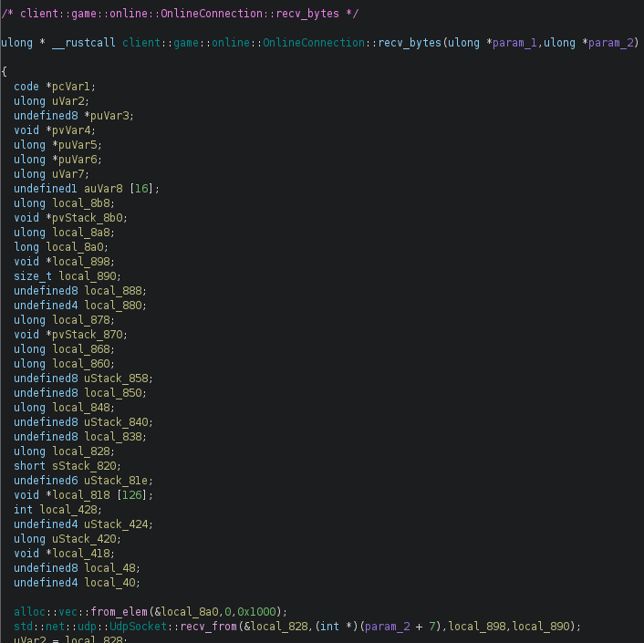

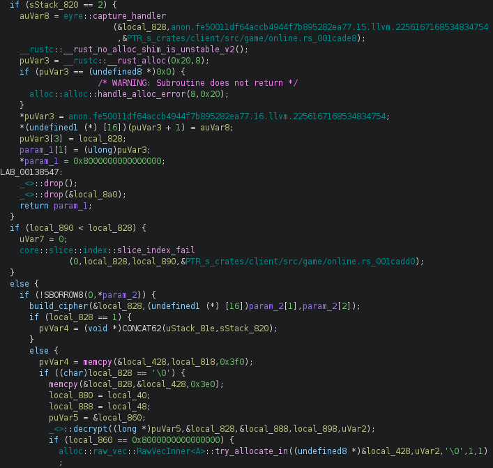

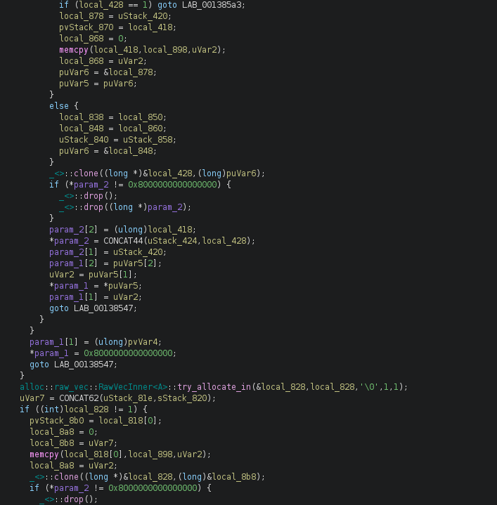

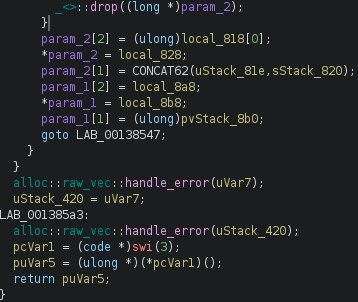

Après une rapide analyse, nous voyons que `param_1` correspond à la valeur de
retour. Il s'agit encore d'un `Result`, reconnaissable notamment à la valeur
`0x8000000000000000`, qui correspond au discriminant `Err`. De la même manière
que pour `send_bytes`, `param_2` correspond au `self` de la méthode.

La fonction commence par allouer un buffer de `0x1000` octets, puis appelle
`recv_from` avec la socket stockée dans la structure :

```c
alloc::vec::from_elem(&local_8a0,0,0x1000);
std::net::udp::UdpSocket::recv_from(&local_828,(int *)(param_2 + 7),local_898,local_890);
```

Ensuite, on retrouve la même logique que dans `send_bytes`. Si aucun paquet
précédent n'est stocké, le paquet reçu est considéré comme du clair, copié, puis
stocké dans la structure. Sinon, la fonction reconstruit le chiffrement avec
`build_cipher`, puis tente de déchiffrer le paquet reçu :

```c
build_cipher(&local_828,(undefined1 (*) [16])param_2[1],param_2[2]);
[...]
_<>::decrypt((long *)puVar5,&local_828,&local_888,local_898,uVar2);
```

Si le déchiffrement échoue, le paquet reçu est gardé tel quel. La valeur finale
est ensuite stockée dans la structure puis renvoyée au caller.

On peut aussi remarquer que le chiffrement ne dépend pas seulement du dernier
paquet envoyé, mais du dernier paquet envoyé ou reçu en clair. En effet,
`send_bytes` et `recv_bytes` lisent et mettent à jour les mêmes champs dans
`self`. Dans notre cas, les offsets `1` et `2` correspondent sûrement au buffer
et à la taille.

L'offset `0` sert à représenter l'état de l'`Option`, tandis que les offsets
suivants contiennent sa valeur lorsqu'elle est présente. Cela correspond
probablement à un champ de type `Option<Vec<u8>>`.

Nous avons maintenant les éléments nécessaires pour comprendre la logique réseau.
Il reste à voir comment le programme chiffre les paquets et crée la clé de
chiffrement. Pour cela, regardons la fonction `build_cipher` :

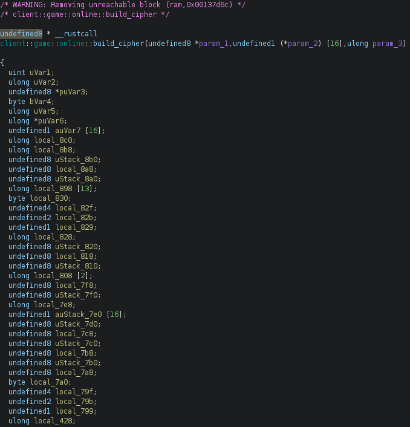

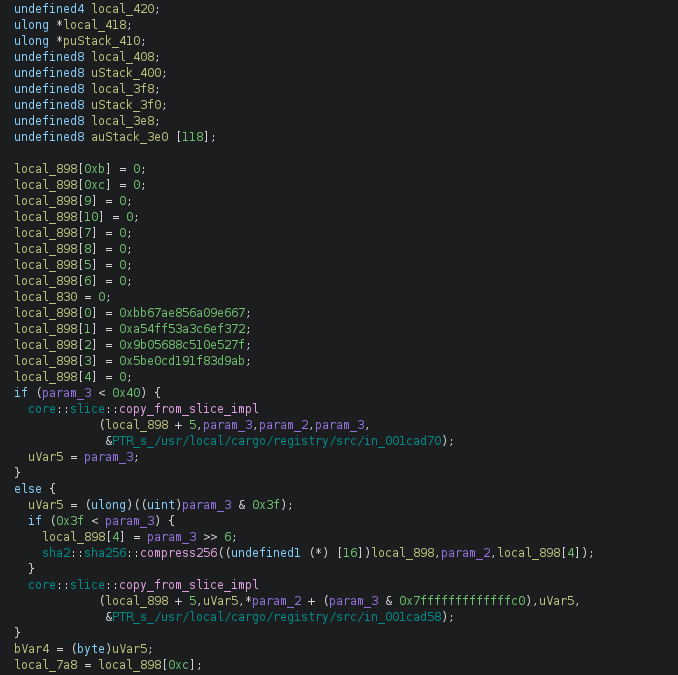

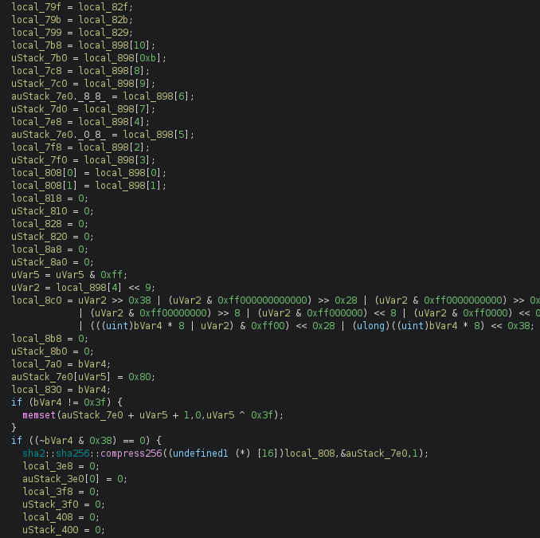

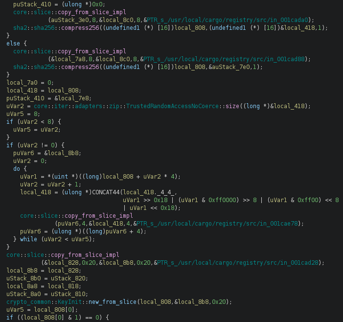

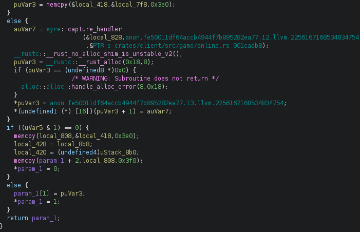

La fonction contient beaucoup de gestion d'erreurs, mais nous pouvons tout de
même repérer plusieurs points intéressants. On voit notamment une référence à
`sha256` et à `KeyInit` de `crypto_common`.

En regardant la [documentation](https://docs.rs/crypto-common/latest/crypto_common/trait.KeyInit.html),
on voit que `KeyInit` permet de créer une clé à partir d'un slice. On retrouve
aussi ici le comportement déjà observé plus tôt. Le compilateur a séparé le
slice en deux paramètres, avec un pointeur et une taille.

On remarque que `local_808` stocke la valeur de retour. Il s'agit donc d'un
`Result`, car cette valeur est vérifiée ensuite pour gérer les erreurs. On voit
aussi que `local_8b8` contient notre slice. Pour comprendre ce qu'il contient,
nous pouvons remonter dans ses références croisées et regarder son usage :

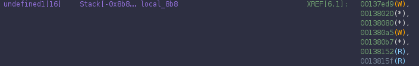

Nous pouvons voir les dernières écritures et les usages par référence indirecte,
représentés par un `*` dans Ghidra.
En testant plusieurs en partant de la fin, nous trouvons ceci :

```c
puVar6 = &local_8b8;
[...]
core::slice::copy_from_slice_impl
          (puVar6,4,&local_418,4,&PTR_s_/usr/local/cargo/registry/src/in_001cae78);
```

Nous voyons que le contenu de `local_418` est copié vers `local_8b8`. En
appliquant le même raisonnement et en remontant les références, nous tombons sur
ceci :

```c
local_418 = local_808;
[...]
uVar2 = core::iter::adapters::zip::TrustedRandomAccessNoCoerce::size((long *)&local_418);
```

De même pour `local_808`, nous tombons sur plusieurs appels à
`sha2::sha256::compress256`. Après un rapide passage dans la
[documentation](https://docs.rs/sha2/0.11.0/sha2/block_api/fn.compress256.html),
nous voyons qu'il s'agit de la fonction de compression utilisée pendant le calcul
du hash.

Comme `SHA256` est composé de plusieurs étapes, nous pouvons remonter au tout
début pour voir les valeurs initiales :

```c
sha2::sha256::compress256((undefined1 (*) [16])local_898,param_2,local_898[4]);
```

Nous voyons que la valeur initiale est `param_2`, qui correspond au dernier
paquet stocké en clair. Cette fonction construit donc la clé de chiffrement en
hachant le dernier paquet stocké en clair.

Pour pouvoir résoudre le challenge, il nous manque une dernière pièce du puzzle,
qui est l'algorithme de chiffrement et de déchiffrement.

Pour cela, nous pouvons regarder les fonctions `encrypt` et `decrypt` que nous
avons trouvées dans `send_bytes` et `recv_bytes`. Sans détailler entièrement ces
deux fonctions, puisque le writeup est déjà assez long, nous pouvons voir
qu'elles utilisent le même algorithme, `AES-GCM 256`. La taille de la clé permet
notamment de confirmer qu'il s'agit de la variante 256 bits.

Dans ces deux fonctions, nous retrouvons ce genre de code :

```c
core::slice::copy_from_slice_impl
          (&local_b8,0xc,param_3,0xc,&PTR_s_/usr/local/cargo/registry/src/in_001cb0c0);
uStack_60 = local_b8;
[...]
local_68 = param_2;
_<>::generate(local_48);
[...]
_<>::encrypt_with_backend_mut(&local_68,(uint *)&uStack_60,(undefined1 (*) [16])local_48);
```

Dans les fonctions appelantes, `send_bytes` et `recv_bytes`, nous voyons que
`param_2` correspond à la clé et que `param_3` correspond au nonce. On peut aussi
le confirmer ici, car seuls `0xc` octets, soit 12 octets, sont copiés depuis
`param_3`. Cela correspond à la taille recommandée du nonce pour `AES-GCM`.

Nous avons maintenant tous les éléments nécessaires pour résoudre ce challenge.

### Algorithme de chiffrement et déchiffrement

L'algorithme de chiffrement et de déchiffrement est assez rudimentaire.
Si aucun paquet n'a encore été envoyé ou reçu, le premier paquet échangé est
traité en clair, puis stocké dans la structure.

À partir du moment où un paquet a déjà été échangé, le programme récupère le
dernier paquet en clair, calcule son `SHA256`, puis utilise ce hash pour dériver
la clé et le nonce utilisés par `AES-GCM 256`. La clé correspond au hash complet
et le nonce aux 12 premiers octets du hash. Le paquet courant est ensuite chiffré
ou déchiffré avec ces valeurs. Enfin, le dernier paquet stocké est mis à jour
avec le paquet courant en clair, qu'il s'agisse d'un paquet envoyé ou reçu.

## Solution

Pour déchiffrer la capture, il suffit maintenant d'appliquer cette logique sur
les paquets UDP dans l'ordre.

Le script de résolution applique directement cette logique :

```python
last_decrypted_payload = None

for payload in payloads:
    if last_decrypted_payload:
        digest = hashlib.sha256(last_decrypted_payload).digest()
        cipher = AESGCM(digest)
        nonce = digest[:12]

        decrypted_payload = cipher.decrypt(nonce, payload, None)
    else:
        decrypted_payload = payload

    last_decrypted_payload = decrypted_payload
```

Une fois les paquets déchiffrés, nous pouvons regarder leur contenu en clair et
voir que le dernier contient le flag. Le script retire les octets nuls éventuels
à la fin du message, puis affiche ce contenu :

```python
return last_decrypted_payload.split(b"\x00", 1)[0].decode("utf-8")
```

Le solve complet est disponible dans le fichier `solve.py`.

### Faiblesse cryptographique

Si nous avons bien compris le fonctionnement de l'algorithme de chiffrement et
de déchiffrement, nous voyons qu'il existe une autre faiblesse importante, en
plus du fait que toute la capture peut être déchiffrée depuis le début.

Comme le chiffrement du paquet suivant dépend uniquement du dernier paquet en
clair, il suffit de deviner le paquet courant pour pouvoir déchiffrer le paquet
suivant. Il n'est donc pas nécessaire de rejouer toute la chaîne depuis le début.

Dans notre cas, le flag est forcément renvoyé après un paquet `move`, puisque le
joueur doit se déplacer sur la case de victoire. Or, ce paquet `move` ne peut
contenir que quatre directions possibles, haut, bas, gauche ou droite.

Nous pouvons donc bruteforcer ce dernier paquet en clair. Cela permet de dériver
la bonne clé et de déchiffrer directement le paquet contenant le flag, sans
traiter toute la capture.

Pour construire ce paquet, il faut aussi tenir compte du fait que le client
utilise `rkyv` pour sérialiser et désérialiser les messages. Il faut donc
reproduire la structure du paquet avant de le sérialiser, afin de pouvoir tester
les quatre directions possibles.

## Flag

Nous obtenons ce flag `BZHCTF{n07_4_g10b41_r3v01u710n}`.
