# Phase Zero - Writeup

## Informations

- **Catégorie** : Reverse
- **Difficulté** : Facile
- **Auteur** : AntwortEinesLebens

## Énoncé

Après la montée des tensions dans plusieurs régions du monde, de nombreuses
nations ont considérablement renforcé leurs investissements en cybersécurité.

Une entreprise émergente, Breizh Systems, s'est rapidement imposée comme un
acteur clé dans la protection des binaires critiques. Réputée pour la solidité
de ses outils, elle a pourtant vu certains de ses premiers prototypes fuiter
récemment.

Parmi ces archives figurent trois artefacts expérimentaux, aujourd'hui
accessibles au public. Selon les rares notes associées, ce programme faisait
partie d'un projet interne visant à repenser la manière dont un logiciel
démarre réellement, en déplaçant certaines décisions critiques hors des chemins
d'exécution attendus.

À première vue, tout semble normal.

**Fichiers fournis :**

- `bs_phase_zero`

## Résumé

Le challenge expose une routine de validation du flag dans la fonction `main`.
Cependant, cette fonction n'est jamais appelée et la vraie validation s'effectue
dans une fonction enregistrée dans la section `.init_array`.

## Analyse initiale

### DIE - Detect It Easy

Nous pouvons d'abord passer le binaire dans
[DIE](https://github.com/horsicq/Detect-It-Easy) pour vérifier s'il n'est pas
packé et obtenir d'autres informations.

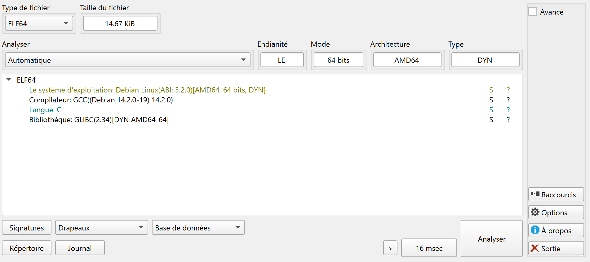

Le binaire n'est pas packé. Il s'agit d'un ELF 64-bit écrit en C et compilé
avec GCC.

### Exécution du binaire

Pour avoir une idée de ce que fait le programme, nous l'exécutons d'abord :

```bash
$ ./bs_phase_zero
Breizh Systems :: artifact phase-zero
Breizh Systems :: enter token: test
Breizh Systems :: status: denied
```

Le programme demande un **token** et valide notre entrée.
Si on entre n'importe quoi, on obtient `status: denied`.
Nous devons donc trouver la fonction de validation.

### Strings

Nous commençons par regarder les chaînes de caractères dans le binaire :

```bash
$ strings bs_phase_zero
Breizh Systems // artifact phase-zero // build A17
Breizh Systems :: artifact phase-zero
Breizh Systems :: enter token:
Breizh Systems :: status: ok
Breizh Systems :: status: denied
Breizh Systems :: invalid state
```

En effectuant la commande `strings`, nous voyons certaines chaînes mais aucun
flag apparent. Nous identifions aussi le message de réussite présumé
(goodboy) : `status: ok`, et le message d'échec (badboy) : `status: denied`.

## Analyse statique

Pour cette analyse, nous utilisons [Ghidra](https://ghidra-sre.org/), mais
vous êtes libre d'utiliser ce que vous voulez.

### Fonctions principales

Après avoir fait analyser le binaire par Ghidra, nous trouvons la fonction
`main` du binaire.

En l'analysant rapidement, nous voyons qu'il récupère l'entrée utilisateur et
qu'il affiche notre message de succès ou d'erreur après avoir fait un présumé
check.

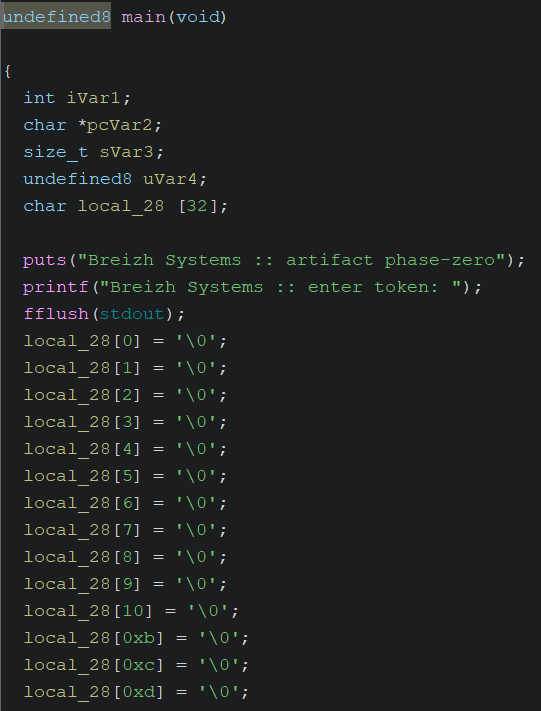

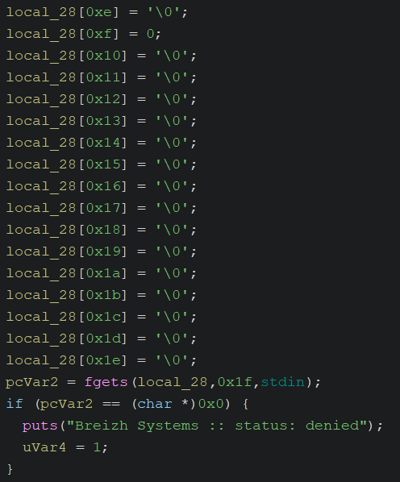

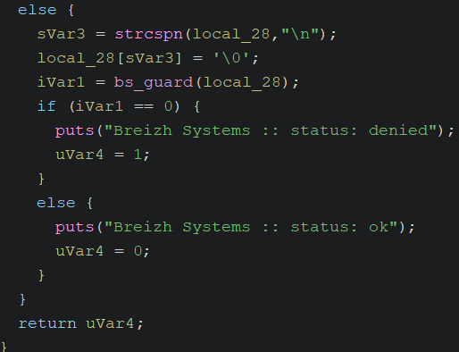

Nous voyons aussi dans la vue décompilée que certains symboles ne sont pas
strippés et sont préfixés par `bs`.

En regardant la liste des fonctions, nous voyons que certaines fonctions sont
présentes mais pas utilisées directement dans `main`.

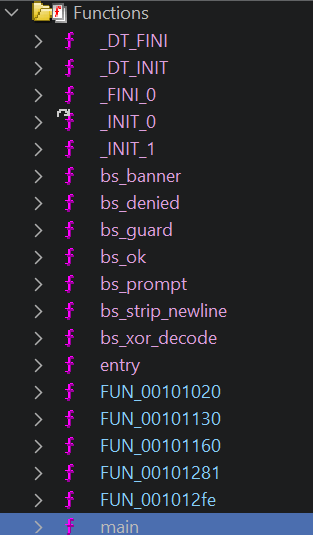

Dans cette liste, nous voyons des fonctions qui nous intéressent : `_INIT_*`.
Ces fonctions sont intéressantes car elles sont référencées dans la section
[`.init_array`](https://maskray.me/blog/2021-11-07-init-ctors-init-array),
qui permet d'exécuter du code avant l'entry point.

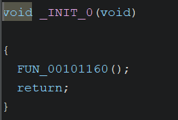

Il s'agit d'une fonction qui appelle une seule autre fonction qui permet
d'initialiser le binaire. Regardons maintenant la fonction `_INIT_1` :

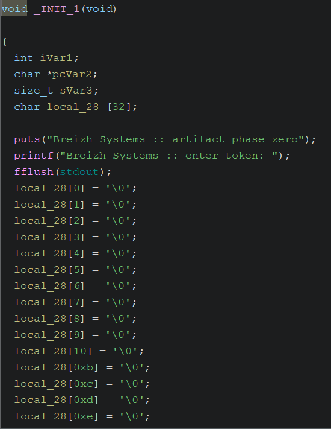

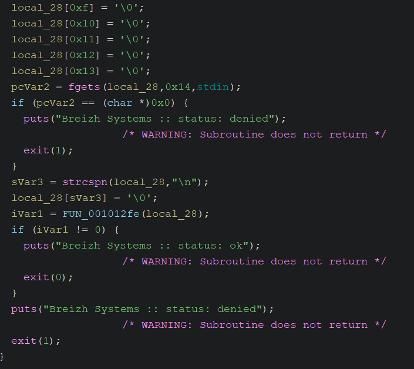

Cette fonction est vraiment intéressante. Elle montre qu'elle a exactement la
même logique que notre `main`, mais tous les chemins mènent vers un appel à
`exit`.

Ce qui veut dire que notre fonction `main` n'est **jamais** appelée. Notre
fonction principale n'est donc qu'un leurre et l'analyser est inutile car la
vraie logique se situe ici.

Nous aurions aussi pu nous en rendre compte en regardant les références
croisées sur les chaînes de caractères vu qu'elles sont utilisées dans les deux
fonctions.

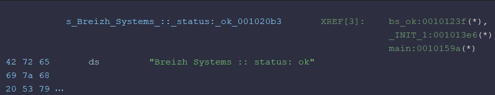

En regardant le code de notre `_INIT_1`, nous voyons qu'il appelle la fonction
`FUN_001012fe` et en fonction de son résultat, il affiche le message de réussite
ou non.

Si la valeur de retour est différente de 0 alors c'est gagné, sinon c'est perdu.
De plus, on peut voir qu'elle prend en paramètre l'entrée utilisateur.

Nous pouvons en conclure qu'il s'agit de la fonction pour vérifier le token.
Allons regarder cette fonction :

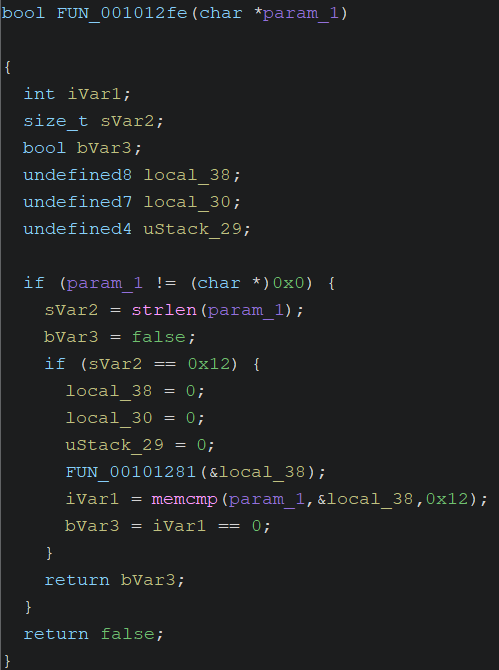

On peut voir que cette fonction calcule la taille de notre entrée et regarde si
elle fait `0x12` caractères. Cela correspond à 18, on peut en conclure que le
flag fait 18 caractères de long environ.

On peut voir ensuite qu'elle appelle la fonction `FUN_00101281` sur un buffer et
compare ensuite ce buffer avec notre entrée via `memcmp`.

Ensuite, elle regarde si le résultat de la comparaison est 0, autrement dit s'ils
sont égaux, et renvoie vrai si c'est le cas, faux sinon.

On peut donc en conclure que ce buffer qu'elle crée est sûrement le flag.

### Algorithme de validation

Regardons maintenant la fonction `FUN_00101281` pour voir la logique de la
création de ce buffer :

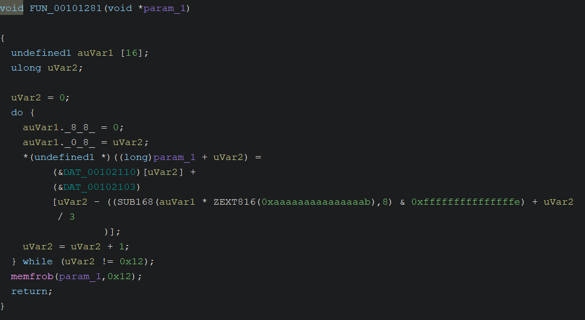

Après avoir renommé et retypé quelques variables, nous obtenons ceci :

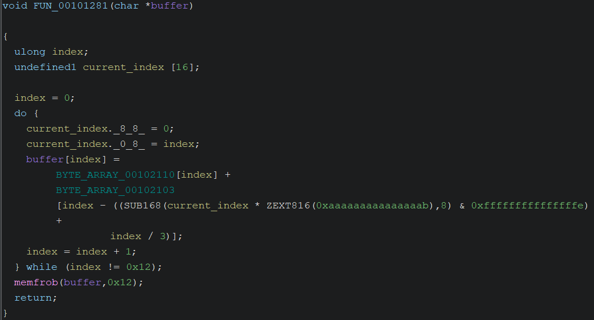

Nous voyons que la boucle va bien jusqu'à `0x12`. Pour chaque tour de boucle,
nous voyons que le caractère courant du buffer de sortie est assigné au
résultat d'un calcul :

```python
output[index] = (encoded[index] + offsets[index % 3])
```

Cependant, dans Ghidra, l'opération `index % 3` apparaît sous une forme
optimisée par le compilateur :

```c
index - ((SUB168(current_index * ZEXT816(0xaaaaaaaaaaaaaaab), 8)
         & 0xfffffffffffffffe) + index / 3)
```

C'est une optimisation du compilateur pour calculer `index % 3`.

Dans Ghidra, les opérations qui ne sont pas directement convertibles en C sont
préfixées par le nom de l'opération :

- `SUB168(..., 8)` : extrait une sous-partie à partir du byte 8 d'une valeur 16 bytes
- `ZEXT816(...)` : zero-extension d'une valeur 8 bytes vers 16 bytes

Après analyse, on comprend que :

- `BYTE_ARRAY_00102110` contient le flag encodé
- `BYTE_ARRAY_00102103` contient les offsets `[2, 1, 0]` qui cyclent

Une fois les offsets ajoutés, nous appelons `memfrob` sur tout le buffer. En
regardant la documentation de
[memfrob](https://www.man7.org/linux/man-pages/man3/memfrob.3.html), nous
voyons qu'il s'agit d'une fonction pour obfusquer les chaînes de caractères.
Cela fonctionne en faisant un XOR sur chaque byte de notre buffer avec la
valeur 42, soit `0x2A`.

Nous avons maintenant la routine globale pour décoder notre flag.

## Solution

Pour obtenir le flag, nous pouvons reproduire les mêmes étapes que le décodage
du flag. Nous avons toutes les variables nécessaires : le flag encodé avec les
valeurs à ajouter et le XOR.

Nous pouvons d'abord créer des variables en Python pour stocker tout ça :

```python
encoded = bytes(
    [
        0x66,
        0x6F,
        0x62,
        0x67,
        0x7D,
        0x6C,
        0x4F,
        0x1A,
        0x44,
        0x19,
        0x1C,
        0x75,
        0x1C,
        0x57,
        0x58,
        0x1C,
        0x52,
        0x57,
    ]
)
offsets = [2, 1, 0]
xor_value = 0x2A
```

Une fois fait, nous pouvons effectuer la logique de décodage. Pour chaque byte,
nous ajoutons l'offset contenu dans le tableau à l'index courant % 3, puis nous
XOR ce byte par `0x2A` :

```python
flag = bytearray(len(encoded))

for index in range(len(encoded)):
    flag[index] = (encoded[index] + offsets[index % 3]) ^ xor_value

print(flag.decode())
```

Grâce à ça, nous obtenons le flag. Vous pouvez retrouver le script de solve
nommé `solve.py` dans le dossier `solve`.

## Flag

Nous obtenons ce flag `BZHCTF{1n17_4rr4y}`.
